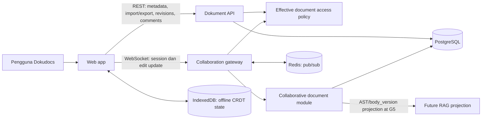
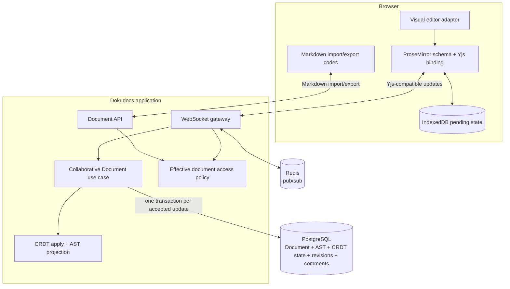

# Arsitektur kolaborasi Markdown Dokudocs

Status: target architecture; keputusan runtime/editor tertentu menunggu spike
Tanggal: 2026-09-27
Detail domain dan persistence: [spesifikasi domain/teknis](../specs/dokudocs-collaborative-markdown-domain-technical.md)
Urutan delivery dan gerbang: [rencana refactor](../plans/dokudocs-ltree-collaborative-refactor.md)
Penutup temuan audit dan prasyarat: [rencana gap closure](../plans/dokudocs-refactor-gap-closure.md)
Proyeksi setelah AST: [fondasi RAG dan chatbot](../plans/dokudocs-rag-foundation.md)
Peta implementasi lintas AST, offline, suggestion, dan RAG: [arsitektur penuh](dokudocs-full-implementation-architecture.md)

Gate G0–G5 pada rencana gap closure adalah sumber eksekusi tunggal. Dokumen ini menjelaskan bentuk target; LTree opsional setelah query dan benchmark membuktikan manfaat, suggestion baru disimpan pada G4, dan RAG dimulai pada G5.

## Tujuan arsitektur

Mendukung edit Markdown online dan offline oleh beberapa pengguna. Schema tree ProseMirror/Yjs mengikuti pola Outline; server memproyeksikan Accepted Edit ke AST relasional Dokudocs yang menjadi representasi kanonis untuk query, Markdown, komentar, dan revisions, serta sumber RAG pada fase G5. Setiap Accepted Edit menyimpan state CRDT, AST, parent/order, versi body, dan perubahan anchor terkait secara atomik ke PostgreSQL sebelum ACK. Jika kelak diadopsi, path LTree turunan ikut transaksi. Browser IndexedDB mempertahankan state/update lokal sampai ACK. Redis hanya untuk fan-out.

Arsitektur ini hanya berlaku untuk dokumen Markdown. DBML dan Mermaid tetap pada jalur teks existing.

## System context



Pengguna tetap memakai autentikasi, workspace/project membership, dan `document_accesses` Dokudocs, dengan satu effective policy yang diperbaiki untuk visibility, draft, grant, dan lifecycle. Data demo localStorage/Zustand tidak dimigrasikan. IndexedDB adalah persistence produk baru untuk offline CRDT state dan update pending; state UI seperti panel dan selection tetap lokal.

## Container dan komponen



### Tanggung jawab komponen

| Komponen | Memiliki tanggung jawab | Tidak boleh memiliki |
| --- | --- | --- |
| Visual editor adapter | Mengubah interaksi visual menjadi update model bersama; mempertahankan selection/undo yang didukung editor. | Aturan akses, SQL, atau sumber body kedua. |
| Markdown AST codec | Parse/export Markdown, validasi grammar, memetakan block/container/run dan syntax opaque. | Akses database, autentikasi, atau session state. |
| Document API | Metadata, load/export Markdown, revisions, comments, dan jalur import. | Update kolaboratif yang melewati aturan transaksi bersama. |
| WebSocket gateway | Autentikasi koneksi, framing, backpressure, pemanggilan use case, dan transport fan-out. | Menjadi otoritas ACL atau memutasi AST langsung. |
| Collaborative Document module | Memeriksa command, serialisasi per dokumen, apply CRDT, membuat AST projection dan commit receipt. | Detail WebSocket, markup UI, atau fan-out sebagai durability. |
| PostgreSQL adapter | Lock dan simpan `documents`, `document_nodes`, `document_collab_states`, revisions/comments dalam transaksi. | Interpretasi frame atau identity dari payload client. |
| Redis adapter | Pub/sub antar-instance. | Sumber body durable atau satu-satunya salinan update yang sudah ACK. |
| IndexedDB adapter | Menyimpan local CRDT state, pending updates, schema version, dan sync receipt. | Bukti server sync sebelum durable ACK diterima. |

Runtime CRDT (Go-compatible atau Node) dipilih melalui spike. Setelah dipilih, hanya satu runtime/write authority yang boleh mengubah state kolaboratif. Jangan mempertahankan abstraction/factory multi-runtime setelah spike.

## Data ownership dan consistency boundary

| Data | Pemilik/sumber kebenaran | Penyimpanan |
| --- | --- | --- |
| Metadata, workspace, access, lifecycle | Model Dokudocs existing | PostgreSQL |
| Struktur dan isi Markdown | Document Body AST; `parent_id` + `sibling_order` kanonis | PostgreSQL `document_nodes` |
| Hierarki untuk query subtree | `parent_id` dan sibling order kanonis | Recursive query pada awal; path LTree opsional dan rebuildable setelah gate benchmark |
| Causal/convergence state | Yjs-compatible encoded state yang konsisten dengan AST | PostgreSQL `document_collab_states` |
| Urutan Accepted Edit | Nomor `body_version` monotonik per dokumen | Baris `documents` |
| Session dan koneksi sementara | Keanggotaan koneksi/routing; editor modes adalah adapter ke model yang sama | Runtime session |
| Pending offline edits | Local Yjs state/update sampai durable ACK diketahui | Browser IndexedDB |
| Fan-out lintas instance | Salinan transport dari update yang sudah durable | Redis pub/sub |
| Komentar/revisi | Aggregate existing dengan anchor/snapshot yang disesuaikan | PostgreSQL |
| Suggestion pending/riwayat (G4) | Proposal terpisah dari body; hanya acceptance memutasi AST/Yjs | PostgreSQL `document_suggestions` pada G4 |
| RAG source (G5) | AST section/block projection dengan node IDs, breadcrumb, `body_version`, dan ACL | Derived async projection setelah G0–G4 |
| DBML/Mermaid body | `documents.content` text existing | PostgreSQL |

PostgreSQL row lock pada dokumen adalah baseline serialisasi. Dokumen berbeda dapat diproses paralel; update dokumen yang sama menunggu satu sama lain. AST dan CRDT state tidak boleh commit terpisah. `body_version` adalah urutan durable Dokudocs, bukan Lamport clock/vector clock CRDT.

Untuk setiap update durable, lock dan recheck policy dalam urutan G0: shared workspace membership; shared project lalu project membership; document row `FOR UPDATE`; shared direct document grant. Jika grant belum ada, row dokumen menjadi parent fence. Perubahan ACL mengambil exclusive lock pada row sumber yang sama dengan urutan yang sama. Dengan begitu visibility/lifecycle dokumen dan body write terserialisasi pada row dokumen, sedangkan revoke membership/grant terserialisasi pada sumber ACL-nya.

## Write flow: edit sampai ACK

```mermaid
sequenceDiagram
  participant C as Editor client
  participant W as WebSocket gateway
  participant S as Collaborative Document module
  participant P as PostgreSQL
  participant R as Redis pub/sub
  participant O as Gateway lain

  C->>W: UPDATE(documentId, updateBytes, updateId)
  W->>S: Apply(actor, session, update)
  S->>S: Authenticate dan validasi batas payload
  S->>P: BEGIN; shared lock workspace membership
  S->>P: shared lock project then project membership
  S->>P: lock document row FOR UPDATE
  S->>P: shared lock direct document grant (if absent, document row is parent fence)
  S->>P: Recheck effective access under locks
  S->>P: Load encoded CRDT state + AST
  S->>S: Apply update pada working CRDT state
  S->>S: Validate AST, parent/order, opaque nodes, anchors; derive node delta
  S->>P: Save CRDT state + AST + anchors + body_version
  S->>P: COMMIT
  S-->>W: CommitReceipt(body_version)
  W-->>C: ACK(updateId, body_version)
  W->>R: Publish durable update
  R-->>O: Forward update
```

ACK hanya berarti transaksi PostgreSQL commit. Update tidak boleh dipublish sebagai Accepted Edit sebelum commit. Revocation dan edit memakai urutan lock yang sama agar hak akses tidak berubah di antara cek dan commit. Working CRDT state harus terisolasi dari cache sesi sampai transaksi sukses; rollback membuang working copy. Retry setelah commit tetapi ACK hilang harus idempotent.

Fan-out dapat gagal setelah ACK. Isi tetap durable dan origin boleh menghapus pending lokal. Subscriber membandingkan `body_version` dari pesan dan pemeriksaan head version berkala ke server; gap memicu state-vector resync, termasuk saat pesan terakhir hilang dan tidak ada update berikutnya. Jika spike membuktikan mekanisme ini tidak cukup untuk target reliability, evaluasi outbox durable sebelum menambahkannya.

## Join, editor adapters, dan reconnect

1. Client membuka WebSocket melalui mekanisme browser-compatible yang dipilih dalam spike; token tidak masuk URL/log, `Origin` divalidasi, dan identitas tidak diambil dari payload `JOIN`.
2. Gateway mengotorisasi actor lewat effective document policy dan memeriksa status dokumen.
3. Editor visual mengikat ke schema ProseMirror/Yjs bersama. Pengalaman view/editor/suggestion tetap ada meski Muya diganti; suggestion adalah proposal terpisah dari body. Tidak ada editor source Markdown mentah yang menjadi jalur tulis kedua.
4. Server mengirim encoded CRDT state terkini dan `body_version`; IndexedDB menyimpan state lokal dan operasi yang belum mendapat ACK.
5. Saat reconnect, server recheck akses dan `body_epoch` sebelum menerima state vector/pending updates. Epoch yang sama boleh merge update isi/format dan replay `MoveNode`/`DeleteNode` di bawah lock dokumen; penghapusan node existing hanya lewat DeleteNode ber-receipt. Update/command dari epoch sebelum restore atau structural command ditahan untuk review dan tidak diterapkan otomatis.
6. UI menyebut update “tersimpan di perangkat” setelah IndexedDB commit dan “tersinkron ke server” hanya setelah ACK Postgres. IndexedDB menyimpan queue `MoveNode`/`DeleteNode` terpisah dari Yjs text/format updates; local move tampil sebagai overlay sampai command server-ordered diterima. Revoke edit menahan retry dan masih mengizinkan ekspor jika hak baca terverifikasi; revoke baca yang dikonfirmasi server menghapus cache/pending dokumen pada client.

`GET /documents/{id}/body` menghitung `canEdit` dari policy yang sama dalam transaksi baca body. Frame WebSocket `ready` dan `resync` membawa capability terkini. Pemeriksaan head lima detik mengirim `resync` walau `body_version` tetap bila hak edit berubah; ini memperbarui mode baca/tulis tab yang masih terbuka. Capability client hanya mengendalikan UI: setiap update tetap melewati cek hak edit dan lock ACL server dalam transaksi durable. Jika capability berubah menjadi baca saja sementara pending lokal ada, client mengunci editor dan menahan pending untuk pemulihan, tanpa mengirim ulang.

Offline hanya berlaku untuk dokumen existing yang body lengkapnya sudah tersimpan pada perangkat; create/import baru memerlukan koneksi. Service worker menyimpan app shell, aset editor, dan navigation fallback, bukan respons API, sehingga URL dokumen yang diketahui dapat dibuka lagi setelah browser restart. Tidak ada daftar/search offline. Cache lokal hanya dapat dibuka selagi AccessToken tersimpan belum kedaluwarsa; token expired mengunci body/pending sampai User yang sama login online, tanpa menghapus pending. Reconnect memeriksa hak terkini sebelum sync. Dalam satu profil browser, satu tab aktif menjadi penulis per User+Document, dan tab lain baca saja sampai handoff. IndexedDB gagal berarti input edit baru berhenti sampai perubahan pending berhasil disimpan. Logout terkonfirmasi menghapus state lokal User setelah menawarkan sync atau ekspor yang diizinkan.

Presence dan cursor bukan bagian dari tahap pertama sinkronisasi isi. Suggestion meliputi teks, format, serta perubahan struktur blok sejak rilis pertama; usulan hanya dibuat/diputuskan saat online. Pending proposal terlihat hanya oleh pengusul dan editor/owner yang masih boleh membaca, tidak masuk body/revision/export/RAG. Acceptance revalidasi target di bawah lock dan menghasilkan Accepted Edit; target struktur yang berubah secara tak aman menjadi konflik untuk tinjauan. Acceptance yang memindahkan atau menghapus node lama mengikuti `MoveNode`/`DeleteNode`: bila struktur berubah, `body_version` dan `body_epoch` naik atomik bersama body/status/receipt dan pending epoch lama ditahan untuk review.

## Read, import/export, comments, revisions

- Baca dokumen Markdown melalui AST. Exporter menghasilkan Markdown untuk API download/import; `documents.content` bukan write path kedua setelah cutover.
- DBML dan Mermaid tetap baca/tulis sebagai teks melalui jalur existing.
- Import/backfill Markdown membuat root, node, state CRDT awal, dan versi body secara transaksional. Retry dengan input/schema sama harus menghasilkan node IDs deterministik.
- CommentThread tetap hidup ketika node dihapus. Anchor tahap pertama hanya satu blok, menggunakan satu node ID, Yjs relative positions, dan quote untuk verifikasi. Gagal resolve menjadi orphan; quote tidak dipakai untuk reattach otomatis bila ambigu.
- Autosnapshot mempertahankan coalescing 10 menit yang ada. Named revision immutable. Restore menjadi Accepted Edit baru, membangun Yjs state dari snapshot, menaikkan `body_version` dan `body_epoch` dalam satu commit, lalu menyiarkan epoch baru; revision sebelumnya tidak ditulis ulang. Pending epoch lama ditahan untuk review berdampingan dengan body hasil restore; pengguna berhak edit menyalin teks/blok terpilih sebagai edit baru. Structural MoveNode/DeleteNode juga menaikkan kedua versi karena writer membangun ulang shared state; pending dari epoch sebelumnya ditahan untuk review.
- Create, duplicate, Markdown import, restore, dan seeder memanggil domain body write path yang sama agar AST, Yjs state, dan initial `body_version` dibuat konsisten. DBML/Mermaid tetap text.
- `MoveNode` dan `DeleteNode` adalah structural command domain online/offline yang sama; server memvalidasi parent, cycle, order, dan ACL terhadap tree terbaru, lalu memproyeksikan hasil. Invalid command tetap pending untuk resolusi pengguna.

## RAG readiness dan AI authoring

- AST menjadi sumber chunking: mulai dari heading/section dan pecah section panjang pada batas block. Chunk membawa source node IDs, breadcrumb, `body_version`, judul/proyek, source fingerprint, dan ACL metadata. Judul/proyek membantu pencarian; jawaban faktual memerlukan bukti dari blok body. Opaque hanya diindeks bila ada renderer teks aman; node yang dilewati membuat cakupan indeks partial.
- Embeddings, vector store, dan retrieval worker belum dibangun. Ketika kelak diaktifkan, retrieval mengecek ACL terkini dan hanya menyajikan chunk dengan source fingerprint yang sama dengan body dan judul/proyek terkini; index yang tertinggal berarti omit.
- Tahap RAG setelah refactor AST dirinci pada [rencana fondasi RAG](../plans/dokudocs-rag-foundation.md); chatbot dan riwayatnya bukan bagian dari milestone kolaborasi Markdown ini.
- AI membuat dokumen baru sebagai draft Markdown melalui parser dan create-body path. Edit dokumen existing menjadi Suggestion typed operations pada node ID stabil; hanya editor/owner yang menerima dapat menerapkannya melalui body command/revision yang sama. Pending AI proposal tidak menjadi sumber RAG.

## Failure boundaries

| Kegagalan | Perilaku arsitektur |
| --- | --- |
| PostgreSQL unavailable/rollback | Tidak ACK dan tidak publish sebagai durable; IndexedDB mempertahankan pending update untuk retry. |
| Proses berhenti setelah commit sebelum ACK | Retry idempotent atau reconnect membaca state dan `body_version` durable. |
| Redis/pub-sub unavailable | Commit tetap sah; sesi ditandai degraded dan client resync dari PostgreSQL. |
| Gateway/session hilang | Koneksi dipulihkan melalui reconnect dan state-vector sync dari PostgreSQL. |
| Access dicabut | Tolak update berikutnya dan tutup koneksi/lease sesuai policy. |
| Hak edit dicabut ketika offline | Tolak replay saat reconnect dan hentikan retry; pertahankan pending untuk ekspor setelah hak baca terverifikasi. |
| Hak baca dicabut dan dikonfirmasi server | Tutup editor serta hapus cached body dan seluruh pending update/command dokumen pada perangkat. |
| Offline MoveNode/DeleteNode invalid setelah rebase | Tahan command untuk resolusi pengguna; jangan clone/drop node. |
| RAG index tertinggal | Jangan sajikan chunk stale; omit dokumen sampai source fingerprint cocok. |
| Parser tidak mengenali syntax | Simpan source bytes sebagai opaque node baca saja atau gagalkan import dengan laporan; blok lain tetap editable. |
| CRDT state dan AST berbeda | Batalkan transaksi; alarm/telemetry untuk diagnosis. Jangan memilih salah satu diam-diam. |
| Restore atau MoveNode/DeleteNode bersamaan dengan edit | Keduanya melewati serialisasi dokumen; operasi struktur yang diterima membentuk epoch baru. Edit epoch lama ditahan untuk review; peserta aktif menerima state baru atau resync. |

## Scale dan deployment gates

Target produk adalah availability dan scalability tinggi, tetapi angka editor per dokumen, koneksi total, peak edit rate, p95 propagation, availability, serta RPO/RTO belum ditentukan. Sizing harus menetapkan angka tersebut sebelum readiness produksi.

Baseline deployment memakai beberapa gateway/application instances, PostgreSQL HA, dan Redis untuk pub/sub. Extension LTree hanya diperlukan jika gate query/benchmark kemudian mengadopsinya. Topologi dan sizing final belum diputuskan. Load/failover gate wajib menguji:

- contention lock dan waktu transaksi pada satu dokumen panas;
- throughput edit untuk dokumen yang berbeda;
- p95 propagation, ukuran encoded state, projection AST, dan frekuensi resync;
- kehilangan Redis/failover serta PostgreSQL failover;
- recovery seluruh update yang sudah ACK;
- batas memory/runtime pada sesi panjang dan pemulihan state.

Jika PostgreSQL per-document lock tidak memenuhi target, revisi serialisasi/persistensi hot-document sebelum menyebut sistem siap produksi. Jangan menyatakan availability tinggi hanya dari pemilihan PostgreSQL/Redis.

## Keputusan arsitektur yang menunggu spike

1. Runtime Go Yjs-compatible atau service Node Yjs/Hocuspocus.
2. Muya binding atau penggantian editor visual, termasuk perilaku view/editor/suggestion pada shared model.
3. Bentuk CRDT shared type dan cara memastikan AST projection menjaga node identity.
4. Redis/PostgreSQL HA topology, target numerik kapasitas, retention/compaction, dan ukuran payload.
5. Apakah pub/sub resync cukup atau diperlukan durable outbox.

Keputusan produk yang sudah settled—AST kanonis, pola ProseMirror/Yjs, offline pending edits, ACK setelah commit, lock PostgreSQL baseline, future RAG source pada G5, AI human approval, dan scope Markdown saja—tidak dibuka kembali oleh pilihan implementasi ini. G0–G5 tetap satu-satunya execution gates.
