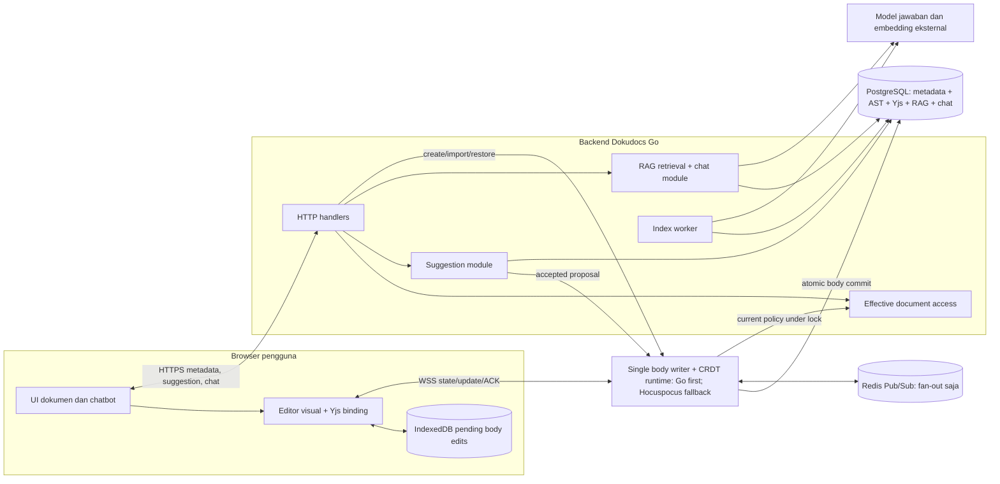
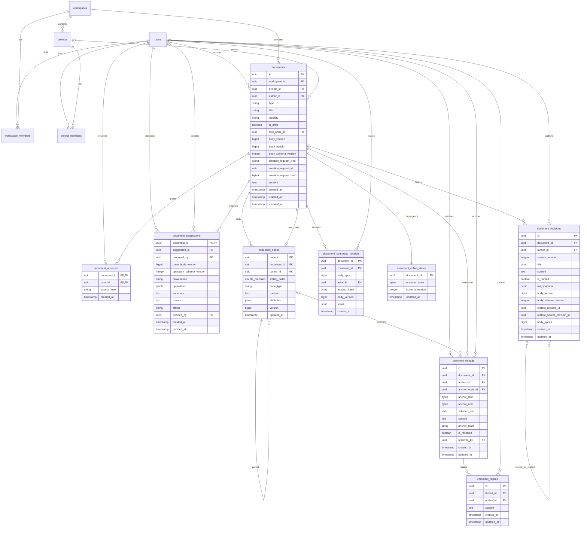
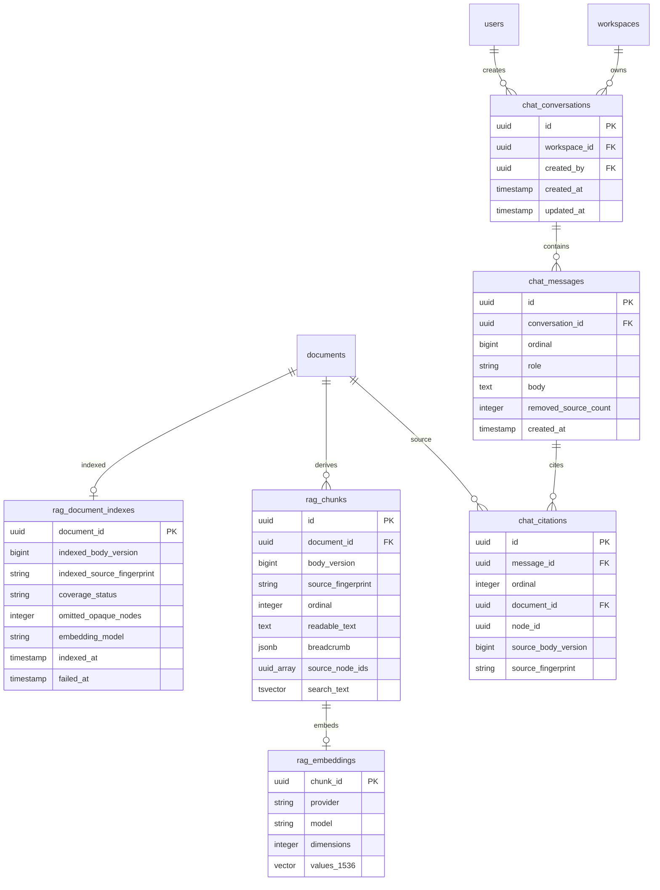

# Arsitektur implementasi penuh Dokudocs: Markdown, kolaborasi, suggestion, dan RAG

Status: **target arsitektur/schema**; implementasi parsial dan belum siap produksi. Spike pertama memakai Go WebSocket + ProseMirror/Yjs; Hocuspocus menjadi fallback bila gate correctness Go gagal. Live E2E membuktikan edit dari browser Yjs melalui editor aktif dan Go WebSocket tersimpan di PostgreSQL, terlihat di klien kedua, dan tetap ada setelah klien baru reconnect. Integration dua proses Go membuktikan Redis Pub/Sub lintas proses serta subscriber re-connect setelah koneksi Redis mereka diputus; setelah proses origin dimatikan pascacommit sebelum klien membaca ACK, klien reconnect ke survivor memperoleh snapshot PostgreSQL dan retry update tidak menaikkan versi lagi. RAG kini memiliki retrieval hybrid, adapter OpenAI opsional untuk embedding/jawaban, serta test HTTP/PostgreSQL/fake model lintas bahasa. Evaluasi retrieval, failover Redis/PostgreSQL terkelola, recovery konflik offline, migrasi consumer Markdown, dan pengalaman suggestion penuh masih terbuka.
Diperbarui: 2026-10-01 (pertama dibuat 2026-09-27)
Rujukan: [urutan dan gate](../plans/dokudocs-refactor-gap-closure.md), [hasil spike G1](../research/dokudocs-g1-runtime-spike.md), [kontrak domain](../specs/dokudocs-collaborative-markdown-domain-technical.md), [arsitektur kolaborasi rinci](dokudocs-collaborative-markdown.md), dan [fondasi RAG](../plans/dokudocs-rag-foundation.md).

ADR terkait: [scope kolaborasi](../adr/0001-collaborative-markdown-scope.md), [AST kanonis](../adr/0002-canonical-markdown-ast.md), [tree Yjs dan proyeksi relasional](../adr/0003-outline-yjs-tree-and-relational-projection.md), [riwayat chat](../adr/0004-persistent-rag-chat-history.md), [akses dokumen](../adr/0005-document-access-policy.md), [track changes](../adr/0006-track-changes-outside-canonical-body.md), [siklus pending offline](../adr/0007-offline-pending-edit-lifecycle.md), [restore memulai epoch](../adr/0008-restore-starts-body-epoch.md), [receipt command struktural](../adr/0009-durable-movenode-receipts.md), [offline restart](../adr/0010-offline-restart-contract.md), [serialisasi revoke](../adr/0011-access-revocation-serialization.md), [command memiliki perubahan struktur](../adr/0012-movenode-owns-existing-node-structure.md), [pending saat schema mismatch](../adr/0013-preserve-pending-edits-across-schema-mismatch.md), dan [perubahan struktural memulai epoch](../adr/0014-structural-moves-start-body-epoch.md).

Dokumen ini adalah peta kemampuan lintas frontend, backend, penyimpanan, sinkronisasi, dan chatbot; gate eksekusi tunggal adalah G0–G5 pada [gap closure](../plans/dokudocs-refactor-gap-closure.md). Model DBML app-wide yang sudah ada di [dbml-dokudocs.dbml](../../dbml-dokudocs.dbml) adalah referensi baseline, bukan bukti migration runtime. Diagram serta tabel schema di bawah bersifat **kontraktual**, bukan SQL migration siap jalankan. Migration AST/Yjs, receipt MoveNode, comment anchor, restore receipt, serta schema/proyeksi awal RAG sudah ada di repo, tetapi penerapan pada database runtime dan cutover consumer belum seluruhnya diverifikasi. `documents.content` tetap menjadi jalur DBML/Mermaid dan fallback Markdown legacy; AST menjadi sumber untuk dokumen Markdown yang sudah diinisialisasi. Implementasi RAG/chat masih parsial.

## 1. Aturan inti dan sumber data

| Data | Sumber kebenaran | Bentuk turunan |
| --- | --- | --- |
| Metadata, workspace, project, grant, lifecycle | PostgreSQL `documents` dan tabel akses yang sudah ada | Daftar/search metadata dan cache UI |
| Body Markdown untuk baca/query/ekspor | `document_nodes` (`parent_id` + `sibling_order`) untuk dokumen yang sudah diinisialisasi; `documents.content` hanya fallback legacy selama G2 | Markdown export; LTree subtree path hanya jika query/benchmark membenarkannya |
| Informasi kausal untuk merge kolaboratif | PostgreSQL `document_collab_states.encoded_state` | State lokal IndexedDB sampai ACK |
| Perubahan yang belum diterima (G4) | PostgreSQL `document_suggestions` setelah fase AST | Overlay suggestion untuk pengusul/editor; tidak menjadi body/RAG |
| Riwayat revisi | PostgreSQL `document_revisions` | Tampilan revision/restore |
| Indeks RAG | Proyeksi yang dapat dibangun ulang dari AST, `body_version`, judul dokumen, dan proyek | Chunk, teks pencarian, embedding |
| Jawaban chatbot lama | PostgreSQL chat messages | Daftar sumber dan penanda sumber berubah/terhapus |

AST dan state CRDT menyimpan representasi body yang harus **commit bersama**. AST adalah model kanonis aplikasi; state CRDT diperlukan untuk melanjutkan merge. `body_version` naik satu kali untuk perubahan body baru yang durable, termasuk penerimaan suggestion, restore, dan perubahan struktural `MoveNode`/`DeleteNode`, tetapi tidak untuk proposal pending, metadata, edit lokal, atau retry duplikat. Restore dan command struktural yang berubah membangun state Yjs baru serta menaikkan `body_epoch`; pending epoch lama ditahan untuk review. Markdown adalah format import/export yang dibangun dari AST, bukan body kedua.

## 2. Peta sistem dan deployment logis



Diagram menunjukkan modul logis, bukan proses final. Gate G1 terlebih dahulu membuktikan `Writer` Go + ProseMirror/Yjs melalui alur browser nyata. Jika gate correctness gagal, uji Hocuspocus sebagai fallback dan tetapkan satu pemilik transaksi body beserta cara Go mengirim create/import/restore/accept kepadanya. Panah policy berarti keputusan akses yang sama harus dievaluasi di dalam transaksi penulis; pemeriksaan izin pra-RPC saja tidak cukup. Go dan Node tidak boleh menjadi dua penulis AST/Yjs yang tidak terkoordinasi. PostgreSQL adalah durability layer. Redis Pub/Sub hanya mengirim hasil yang sudah commit; ia tidak menyimpan update sebagai sumber pemulihan. Model eksternal hanya menerima chunk terpilih setelah policy dan versi diperiksa.

| Varian runtime | Pemilik transaksi body | Syarat sebelum dipilih |
| --- | --- | --- |
| Go-compatible | Kandidat utama untuk spike; application module Go memakai `database.DB.WithTransaction` | Browser Yjs ↔ Go wire/state, editor binding, transaksi AST+Yjs, ACK durable, authorization, dan recovery terbukti. |
| Node/Yjs + Hocuspocus | Fallback jika gate correctness Go gagal | Satu writer Node atau satu gateway transaksi Go harus ditentukan; semua command body memakai writer itu dan membuktikan ACL/commit atomik. Hook persistence Hocuspocus yang di-debounce saja tidak memenuhi kontrak ACK. |

### Pemetaan ke repo

| Seam target | Lokasi yang mengikuti pola repo | Interface minimum |
| --- | --- | --- |
| HTTP transport | `backend/internal/infrastructure/api/routes` dan `presentation` | Parse request, autentikasi, panggil use case, tulis envelope; tanpa SQL/domain logic |
| Effective document access | `backend/internal/application/document` | Satu keputusan baca/tulis/suggest/restore/delete berdasarkan state terkini |
| Markdown Body | `backend/internal/application/document` + `backend/internal/domain/documentbody` | `Validate(Body)` checks grammar and Muya payloads; `ValidateOpaquePreservation(before, after)` guards collaborative projections; load/import/export and accepted edits remain in application/repository adapters |
| Persistence adapter | `backend/internal/infrastructure/repository/document` memakai `database.DB.WithTransaction` | Lock dokumen, load state, commit AST/Yjs/version/anchor bersama |
| Collaboration transport | Go API adapter atau runtime Node hasil spike | Join, update, MoveNode/DeleteNode, ACK, resync; tidak memiliki policy sendiri |
| Suggestion | Use case dokumen + tabel proposal | Propose, list visible, accept/reject dengan revalidasi |
| RAG worker dan chat | Application modules baru setelah AST stabil | Index current version, retrieve authorized chunks, generate grounded answer |
| Browser editor dan data | `frontend/src/features/docs`; API melalui `apiFetch` yang ada | View/editor/suggestion, service worker untuk app shell/aset statis, IndexedDB pending, status sync, chatbot |

Ini adalah seam konseptual, bukan instruksi membuat interface Go untuk setiap baris. Pertahankan modul dengan interface kecil dan letakkan detail parser, row lock, optional LTree rebuild, serta retry di dalamnya.

## 3. Schema data inti

**Ada** berarti tabel sudah ada pada schema existing; **ubah** berarti perlu migration additive; **migration tersedia** berarti DDL migration ada di repo tetapi rollout runtime belum dikonfirmasi; **target** berarti tabel belum dibuat. Seluruh ID dokumen, node, dan pengguna memakai UUID. Nama tabel target dapat diselaraskan dengan konvensi migration saat G1 selesai.



| Tabel | Status dan field penting | Constraint/lifecycle |
| --- | --- | --- |
| `documents` | **Migration tersedia:** tambah `root_node_id UUID`, `body_version BIGINT`, `body_epoch BIGINT`, `body_schema_version INTEGER`, serta nullable `creation_request_kind/id/hash`; pertahankan metadata dan `content` | Unique partial `(author_id, creation_request_kind, creation_request_id)` menyimpan hasil create/duplicate secara durable pada row dokumen itu sendiri; create dan grant owner awal satu transaksi. `content` tetap dipakai DBML/Mermaid dan fallback Markdown legacy sampai G2 cutover lengkap. |
| `document_nodes` | **Migration tersedia; G2 parsial:** `node_id`, `document_id`, `parent_id`, `sibling_order DOUBLE PRECISION`, `node_type`, `content`, `attributes`, `version`, `updated_at` | Unique `(document_id,node_id)` mendukung composite FK parent, anchor, dan `documents.root_node_id` dalam dokumen yang sama. Partial unique index menjamin paling banyak satu root; root wajib menunjuk node tanpa parent setelah cutover Markdown dan tetap ada saat body kosong. Operasi node-level tidak memindahkan atau menghapus root; import/restore mengganti body penuh secara atomik. Validasi body memastikan tepat satu root, semua node terhubung, grammar parent/child sah, tidak ada cycle, dan sibling order finite/unik. Atribut root `trailingWhitespace` menjaga suffix, `sourceGaps` menjaga separator, dan `sourceTables` mempertahankan sintaks tabel asli selama AST tabel masih setara secara semantik; metadata dipetakan dengan node ID. Projection update juga menjaga identitas, bytes, dan penempatan seluruh jalur OpaqueNode. Index parent/order. `node_path`/GiST ditunda sampai query/benchmark mendukungnya. |
| `document_collab_states` | **Migration tersedia; write path diuji pada PostgreSQL integration:** satu `encoded_state BYTEA` per Markdown document, `schema_version`, `updated_at` | `schema_version` harus sama dengan `documents.body_schema_version`; state Yjs dan AST/version commit dalam transaksi yang sama. Integration coverage mencakup writer dan route WebSocket Go. Live browser E2E membuktikan JS Yjs ↔ Go, edit terlihat di klien kedua, dan state PostgreSQL dipulihkan oleh konteks browser baru setelah reconnect. Test dua proses membuktikan fan-out Redis setelah subscriber tersambung kembali, recovery ke survivor pascarestart origin, snapshot kanonis, dan retry idempoten setelah ACK hilang bagi klien. Redis server/PostgreSQL failover terkelola serta migration rollout runtime belum terbukti. Tidak ada op log append-only tahap pertama; tambah outbox/stream durable bila pengukuran gap membenarkannya. Lihat [tes writer](../../backend/internal/infrastructure/repository/document/collaborative_writer_integration_test.go), [tes WebSocket](../../backend/internal/infrastructure/repository/document/collaborative_websocket_integration_test.go), dan [tes browser](../../e2e/ui/specs/smoke/markdown-collaboration.spec.ts). |
| `document_command_receipts` | **Migration tersedia; receipt MoveNode dan DeleteNode diimplementasikan dan diuji pada PostgreSQL integration:** `document_id`, `command_id`, `body_epoch`, `actor_id`, `request_hash`, `body_version`, `result`, `created_at` | Primary key `(document_id, command_id)`; receipt ditulis atomik dengan MoveNode/DeleteNode dan tidak kedaluwarsa sebelum hard delete dokumen. Integration test mencakup commit receipt, retry identik, reuse ID dengan payload lain, no-op MoveNode, dan fence old-epoch. Browser provider mengantre dan retry structural commands; live E2E mencakup DeleteNode online serta MoveNode online/offline. Recovery konflik stale tetap read-only dengan ekspor untuk ditinjau; resolver konflik yang lebih rinci dan rollout database runtime belum terbukti. Uji proses restart terbaru mencakup Yjs text update, bukan command receipt struktural. Lihat [tes MoveNode/DeleteNode](../../backend/internal/infrastructure/repository/document/collaborative_writer_integration_test.go) dan [tes WebSocket](../../backend/internal/infrastructure/repository/document/collaborative_websocket_integration_test.go). |
| `document_accesses` | **Ada:** owner/edit/comment/view | Owner saat ini adalah grant `owner`, bukan `author_id`; direct grant dapat melewati private project selama masih anggota workspace. |
| `comment_threads`, `comment_replies` | **Anchor migration tersedia:** tambah `anchor_node_id`, `anchor_start/end BYTEA`, `anchor_state`; pertahankan isi/reply/resolve | Satu anchor dalam satu blok pada rilis pertama. FK `(document_id,anchor_node_id)` melepas hanya anchor saat node dihapus; thread/reply tidak ikut hilang. UI dan lifecycle end-to-end belum seluruhnya tersambung. |
| `document_revisions` | **Migration tersedia:** tambah `ast_snapshot JSONB`, `body_version`, `body_schema_version`, nullable restore receipt `restore_request_id`, `restore_source_revision_id`, dan `body_epoch` | Unique partial `(document_id, restore_request_id)` membuat retry restore idempotent; receipt menyimpan actor pada `author_id`, source revision, hasil epoch, dan body version. Writer memvalidasi source revision berasal dari dokumen yang sama; kolom source belum memiliki composite FK. Named revision immutable; autosnapshot boleh coalesce 10 menit lalu sealed. `content` tetap untuk DBML/Mermaid. UI/runtime retry dan migration rollout masih perlu verifikasi. |
| `document_suggestions` | **Migration tersedia; endpoint batch proposal/accept/reject dan panel history sudah ada:** primary key `(document_id, suggestion_id)`; satu ID berisi satu atomic change set untuk text/format/insert/delete/move block; proposer, basis `body_version/body_epoch`, versi schema operasi, provenance human/AI, operations, ringkasan/alasan, status, decider, dan waktu keputusan | Accept/reject berlaku untuk seluruh batch; ID lain dapat ditinjau terpisah. Provenance dibatasi ke `human`/`AI` dan status ke `pending`/`accepted`/`rejected`/`conflicted`. Operasi/ringkasan/alasan disimpan setelah terminal. Pengusul dan editor/owner yang masih boleh membaca dokumen dapat melihat proposal beserta riwayatnya; viewer dan public link hanya melihat body kanonis. Acceptance endpoint memeriksa basis/target dan mengubah AST/Yjs secara atomik; acceptance move/delete menaikkan `body_epoch`. **Masih terbuka:** pembuatan suggestion dari selection/comment, overlay inline track changes, dan receipt khusus untuk acceptance struktural. Hard delete dokumen menghapus riwayat. |

`document_nodes` memakai unique `(document_id,node_id)` dan FK komposit `(documents.id, documents.root_node_id) → (document_nodes.document_id, document_nodes.node_id)` agar root, parent, dan comment anchor tidak dapat menunjuk node dokumen lain. `root_node_id` boleh null selama backfill bertahap, lalu wajib terisi untuk setiap dokumen Markdown aktif setelah G2 cutover; writer/domain memvalidasi root menunjuk node tanpa parent dan keseluruhan tree valid. Perubahan parent/order node existing melalui `MoveNode`, penghapusan node existing melalui `DeleteNode`; insert dan reindex sibling dilakukan server-side dalam transaksi. Jika query produk kelak memerlukan LTree, path turunan dihitung dari parent dan ID lalu diindeks hanya setelah benchmark recursive query. Jika midpoint Float64 habis, reindex sibling pada parent yang sama dalam lock dokumen. Rincian validasi grammar/DDL konseptual ada di [spesifikasi](../specs/dokudocs-collaborative-markdown-domain-technical.md#5-model-persistence-postgresql).

### Schema lokal browser untuk kolaborasi dan offline

Implementasi IndexedDB saat ini memakai database `dokudocs-collaboration` versi 1. Scope setiap record adalah pasangan User+Document (`<userID>:<documentID>`), sehingga cache/pending milik akun berbeda tidak tercampur.

| Object store | Key dan record | Lifecycle |
| --- | --- | --- |
| `snapshots` **ada, v1** | `scope` sebagai key; `bodyVersion`, `bodyEpoch`, `bodySchemaVersion`, `encodedState`, `canEdit` | Snapshot ditulis sebelum update dikirim. `canEdit` hanya kapabilitas terakhir yang diketahui UI; server selalu memeriksa ulang izin. |
| `pending-updates` **ada, v1** | `key = scope + ':' + updateID`; index `scope`; `scope`, `updateID`, `bodyEpoch`, `bodySchemaVersion`, `update` | Snapshot dan update ditulis dalam satu transaksi lokal sebelum UI menyebut edit tersimpan di perangkat. Hapus update dan tulis snapshot ACK dalam satu transaksi setelah ACK durable. Epoch/schema lama tetap disimpan untuk recovery; jangan label ulang atau merge otomatis. |
| `pending-structural-commands` **target G1/G3, belum ada** | `key = scope + ':' + commandID`; unique compound index `(scope, ordinal)`; `scope`, `ordinal`, `commandID`, `commandKind`, `bodyEpoch`, `bodySchemaVersion`, payload tervalidasi per jenis command | Menyimpan `MoveNode` dan `DeleteNode` terpisah dari raw Yjs updates, diurutkan per scope, dipertahankan sampai receipt server diterima. Jika epoch asal berubah, tahan untuk tinjauan; jangan relabel epoch atau mengarahkan command ke target lain. Resolusi pengguna membuat command ID baru. |

Penambahan `pending-structural-commands` menaikkan IndexedDB ke versi 2 melalui upgrade additive `onupgradeneeded`; jangan hapus atau tulis ulang row v1 saat upgrade. Alokasi ordinal command dan insert dilakukan dalam satu transaksi readwrite per store.

Metadata dokumen AST yang pernah dibuka disimpan pada storage UI ber-scope User dengan `content` legacy kosong; metadata itu hanya membantu membuka URL yang diketahui. AST/Yjs body offline berasal dari snapshot IndexedDB, bukan cache metadata atau service worker. G3 belum selesai sampai object store queue `MoveNode`/`DeleteNode`, replay/recovery-nya, dan migrasi versi database browser tersedia.

## 4. Schema indeks RAG dan chat



Rilis retrieval memakai `text-embedding-3-small` 1536 dimensi bila `OPENAI_API_KEY` disetel. Embedding tetap opsional; tanpa key, PostgreSQL full-text search tetap berjalan. Hybrid search menggabungkan lexical dan cosine ranks, dan hanya memakai vector provider/model yang cocok. Retrieval menghitung cosine di antara chunk yang sudah lolos ACL dan freshness; ANN/HNSW menunggu benchmark yang menunjukkan scan terfilter menjadi bottleneck. Ambang distance 0,35 masih baseline yang harus dikalibrasi dengan corpus bilingual sebelum rilis.

Jawaban runtime memakai Responses API dengan model default `gpt-5-mini`, JSON Schema `answer`/`source_ids`, dan `store:false`. Tanpa key, request yang menemukan sumber menjawab 503; test integrasi memakai fake model. `store:false` menonaktifkan application-state storage untuk response, tetapi abuse-monitoring logs pada konfigurasi provider default masih dapat menyimpan konten sampai 30 hari; kebijakan organisasi OpenAI harus diverifikasi sebelum produksi. [Structured Outputs](https://developers.openai.com/api/docs/guides/structured-outputs), [gpt-5-mini](https://developers.openai.com/api/docs/models/gpt-5-mini), [data controls](https://developers.openai.com/api/docs/guides/your-data).

| Tabel target | Isi dan aturan |
| --- | --- |
| `rag_document_indexes` **G5 parsial** | Status per dokumen: indexed body version/epoch, source fingerprint, metadata judul/proyek, renderer version, coverage, jumlah node opaque, dan waktu indeks. Ini membuktikan proyeksi AST/metadata terkini; kesegaran embedding dilacak per chunk. |
| `rag_chunks` **G5 parsial** | Proyeksi section/block: `document_id`, `node_id`, `body_version`, `source_fingerprint`, urutan, teks body terbaca, judul/proyek untuk discovery, dan breadcrumb. Chunk bukan identitas permanen; sumber jawaban mengacu node ID body. |
| `rag_embeddings` **G5 parsial** | Satu vector `vector(1536)` per chunk beserta provider, model, dan dimensi. Upsert hanya diterima bila chunk, body version, dan source fingerprint masih cocok; chunk lama menghapus embedding lewat FK cascade. Reindex model mengganti vector per chunk. |
| `chat_conversations` **target G5** | Workspace dan pembuat, `created_at`, serta `updated_at` yang maju saat pesan ditambahkan; FK workspace/pembuat menghapus chat saat workspace atau akun hard delete, tetapi keluar dari membership **tidak** menghapus chat. Hanya pembuat boleh membaca. |
| `chat_messages` **target G5** | User question/assistant answer dengan `ordinal` monotonik mulai dari 1 per conversation dan `created_at`; unique `(conversation_id,ordinal)` memberi urutan stabil. `role` dibatasi ke `user`/`assistant`. `removed_source_count INTEGER NOT NULL DEFAULT 0` menghitung citation yang dihapus karena sumber dihapus permanen. Pesan jawaban lama tidak menjadi bukti retrieval baru. |
| `chat_citations` **target G5** | Referensi jawaban dengan `ordinal` urutan daftar mulai dari 1, dokumen, node body, `source_body_version`, dan `source_fingerprint`. Unique `(message_id,ordinal)` menjaga urutan sumber historis. FK ke dokumen memakai delete cascade supaya hard delete membersihkan citation; `node_id` tetap nilai historis ketika blok berubah/hilang, sehingga UI dapat menandainya tanpa mengarah ke blok salah. |

Constraint/index minimum: `rag_document_indexes.document_id` PK/FK ke `documents`; coverage hanya `complete`/`partial`. Indeks stale membuat dokumen dilewati retrieval. `rag_chunks.document_id` FK dan unique `(document_id,ordinal)`, GIN untuk full-text/breadcrumb; `rag_embeddings.chunk_id` PK/FK cascade, vector berdimensi 1536, provider/model disimpan per vector. `chat_conversations.workspace_id` dan `created_by` FK cascade serta index `(created_by,updated_at)`; tidak ada FK ke `workspace_members`, sehingga riwayat tetap ada setelah anggota keluar. `chat_messages.conversation_id` FK cascade, `CHECK role IN ('user','assistant')`, `CHECK ordinal > 0`, unique `(conversation_id,ordinal)`, serta `removed_source_count >= 0`. Append mengunci row conversation, menetapkan ordinal berikutnya, dan memperbarui `updated_at` dalam transaksi yang sama. `chat_citations.message_id` dan `document_id` FK cascade, `CHECK ordinal > 0`, `CHECK source_body_version > 0`, unique `(message_id,ordinal)`, dan index `document_id`. `node_id` citation tidak memakai cascade FK node agar blok yang hilang tetap dapat ditandai sebagai sumber berubah. Saat hard delete dokumen, application transaction menambah `removed_source_count` pada jawaban terdampak sebesar citation rows yang dihapus **sebelum** FK cascade berjalan; cascade sendiri tidak menyimpan penanda itu. Citation yang disimpan harus berasal dari workspace conversation yang sama. Saat riwayat dibuka, bandingkan `source_fingerprint` dengan sumber terkini dan periksa apakah `node_id` masih ada untuk menampilkan status berubah atau blok hilang.

Baseline yang sudah dipilih adalah `text-embedding-3-small`, `vector(1536)`, dan pgvector. Perubahan model/provider memicu pengisian ulang vector; perubahan dimensi memerlukan migration tipe. Retrieval menggabungkan lexical dan cosine ranks, memakai cutoff cosine 0,35 sementara. Sebelum produksi, evaluasi baseline terhadap corpus bilingual dan kalibrasi cutoff; full-text tetap aktif jika embedding provider tidak dikonfigurasi. [PostgreSQL full-text search](https://www.postgresql.org/docs/current/textsearch.html), [pgvector](https://github.com/pgvector/pgvector).

Worker mengambil snapshot AST/metadata dan fingerprint sumber `F` yang mencakup `body_version`, judul dokumen, ID/nama proyek, dan versi renderer, beserta konfigurasi embedding model/version `M`; rendering serta embedding berlangsung di luar transaksi publish. Transaksi publish membandingkan kembali fingerprint dan konfigurasi embedding terkini dengan `(F,M)`, lalu hanya bila keduanya sama mengganti seluruh chunk aktif dan menandai `indexed_source_fingerprint`, `indexed_body_version`, serta `embedding_model`. Jika salah satu berubah, hasil dibuang dan versi terkini dijadwalkan ulang. Retrieval hanya memakai indeks bila fingerprint/body version cocok dengan sumber terkini dan model embedding cocok dengan konfigurasi aktif; saat embedding tidak aktif, `embedding_model` null dan retrieval lexical memakai teks chunk tanpa vector. Perubahan yang commit sesudah publish juga langsung membuat indeks lama tidak layak disajikan. Target operasionalnya, setelah edit berhenti, dokumen biasanya kembali tersedia dalam sekitar satu menit; ukur target ini saat implementasi, jangan perlakukan sebagai SLA keras. Blok opaque hanya menghasilkan chunk bila renderer aman memberikan teks terbaca beserta referensi node; jika dilewati, status menjadi `partial` dan jumlah node tercatat. Indeks stale membuat dokumen dilewati dan UI memberi tahu bahwa hasil mungkin belum lengkap; status partial ditampilkan kepada pengguna berizin. Judul/proyek membantu discovery; jawaban faktual harus didukung blok body yang bisa dikutip.

## 5. Policy akses sebagai satu keputusan efektif

Urutan evaluasi: identitas/token → dokumen dan workspace asli dari database → lifecycle → membership workspace untuk jalur internal → visibility proyek/dokumen → direct grant dan role → filter draft → izin operasi. Endpoint public token memiliki jalur baca tersendiri tetapi memakai kondisi draft/trash yang sama. List, detail, export, WebSocket, RAG, suggestion, restore, dan delete harus memakai hasil policy atau filter SQL yang ekuivalen.

| Kondisi | Hasil penting |
| --- | --- |
| `inherit` + project workspace/tanpa project | Anggota workspace dapat baca; draft tetap dibatasi. |
| `inherit` + project private | Anggota proyek yang berhak, owner/admin workspace, atau direct document grant dapat baca. |
| `visibility=workspace` | Anggota workspace dapat baca walau project private. |
| `visibility=private` | Penulis, pemegang grant, atau owner/admin workspace dapat baca. |
| `visibility=public_link` | Perlu token valid untuk jalur tautan; chatbot boleh memakai dokumen itu tanpa grant hanya jika anggota workspace memberi token valid pada sesi chat saat ini. Flag saja tidak cukup. |
| Metadata proyek private | Nama proyek dan kategori hanya untuk workspace owner/admin atau anggota proyek; direct document grant dan visibility dokumen tidak membuka metadata proyek. Proyek `workspace` terlihat kepada anggota workspace. |
| Project API | List/detail/categories/members membatasi proyek private ke anggota proyek dan workspace owner/admin; direct document grant tidak membuka katalog atau daftar anggota proyek. Document count hanya menghitung dokumen yang dapat dibaca actor. |
| Draft | Hanya penulis atau pemegang hak edit/owner efektif. |
| Trash | Tidak masuk baca normal, kolaborasi, public link, atau RAG. |
| Restore/hard delete | Grant owner dokumen saat ini atau owner/admin workspace; SQL memeriksa workspace dokumen dari database. |
| Mengelola grant `owner` | Hanya pemilik grant saat ini atau owner/admin workspace; akses edit biasa hanya boleh mengelola grant non-owner. |
| Create/duplicate/move ke proyek private | Memerlukan manager/editor proyek tujuan atau owner/admin workspace. Grant edit ke dokumen existing tidak memberi hak penempatan proyek. Proyek visibility workspace dapat menerima dokumen dari anggota workspace. |
| Suggestion | Commenter boleh mengusulkan; editor/owner boleh menerima/menolak. Isi proposal/riwayat terlihat hanya oleh pengusul dan editor/owner yang masih boleh membaca. |

Untuk operasi yang memindahkan dokumen antarproyek, lock seluruh project row menurut urutan UUID, lalu lock project membership dalam urutan yang sama. Ini menghindari deadlock pada perpindahan silang yang berjalan bersamaan.

Revoke grant, perubahan visibility/draft/trash, dan penghapusan membership tidak menaikkan `body_version`; karena itu RAG tidak boleh memakai ACL snapshot indeks sebagai otoritas. Edit dan mutasi ACL terserialisasi melalui sumber lock yang sama sesuai urutan G0: workspace membership, project/project membership, document row, lalu direct grant. Jika operasi bergantung pada membership beberapa pengguna, lock semua row membership itu menurut urutan UUID sebelum mengambil lock project. Pemeriksaan edit terakhir dilakukan dalam transaksi sebelum commit. Token `public_link` tidak dimasukkan dalam payload list/detail/public document; ia hanya dikembalikan oleh endpoint token setelah hak edit terverifikasi, lalu dapat dipakai pada request/sesi aktif. Chat history lama punya aturan lain: pembuat tetap boleh membacanya setelah keluar workspace, tetapi endpoint kirim pertanyaan baru tetap memerlukan membership. Token divalidasi lagi saat retrieval dan tidak disimpan dalam chunk atau riwayat chat.

`documents.project_id` harus selalu menunjuk proyek di `documents.workspace_id`. Schema sekarang hanya punya FK `project_id → projects.id`, jadi create/move dan backfill perlu memverifikasi kesesuaian itu; setelah data bersih, tambahkan constraint komposit bila layak. Tanpa aturan ini, visibility proyek bisa dievaluasi dari workspace yang salah.

## 6. Interface dan kontrak transport

| Jalur | Operasi logis | Hasil/aturan |
| --- | --- | --- |
| HTTP dokumen yang sudah ada | List/detail/create/metadata/trash/access/public | Pertahankan envelope existing dan `apiFetch`; body write Markdown lama dialihkan ke satu domain write path. DBML/Mermaid tetap teks. |
| HTTP body Markdown baru | Load AST, import/export Markdown, revision/restore, comments | Semua baca memakai policy; create/duplicate/import/restore membuat AST dan Yjs state konsisten. Create dan duplicate memakai UUID stabil pada header `Idempotency-Key` untuk retry aman. Tidak ada REST full-text overwrite untuk edit kolaboratif. |
| HTTP Suggestion baru | Propose/list/accept/reject | Proposal online-only; accept revalidate dan commit satu Accepted Edit; reject tidak mengubah body/version. |
| WebSocket logical protocol | `JOIN`, `UPDATE(updateId,bodyEpoch,bytes)`, `MOVE(commandId,bodyEpoch,...)`, `ACK`, `RESYNC` | Auth browser-compatible tanpa token di URL/log; validasi Origin. Epoch lama ditolak sebelum merge; ACK hanya berarti PostgreSQL commit, bukan fan-out Redis. |
| HTTP RAG/chat baru | `Ask(workspace, question, conversation, currentSessionPublicLinkProofs)`; list/read/delete conversation | Ask memerlukan membership + ACL sumber saat itu. Bukti `public_link` berlaku hanya pada request/session aktif, divalidasi ulang, dan tidak disimpan pada conversation/message. Read history memakai ownership conversation meski membership sudah berakhir; append menjadi read-only setelah keluar. |

| Mode UI | Data yang ditampilkan | Jalur perubahan |
| --- | --- | --- |
| View | Body AST/Yjs yang sudah diterima; viewer tidak melihat usulan | Tidak menulis body; link sumber RAG menuju `node_id` stabil. |
| Editor | Body kanonis ditambah overlay lokal pending milik pengguna | Yjs update/MoveNode/DeleteNode melalui WebSocket dan IndexedDB; status perangkat berbeda dari status server. |
| Suggestion | Body kanonis dengan overlay proposal yang boleh dilihat pengusul/editor | Online HTTP propose/accept/reject; proposal tidak dikirim sebagai Yjs body edit sampai acceptance. |
| Chat | Jawaban historis dan daftar sumber, dengan status sumber berubah/terhapus | Pertanyaan baru memakai retrieval versi/izin terkini; riwayat read-only setelah keluar workspace. |

Browser WebSocket constructor hanya menerima URL dan subprotocol, sehingga mekanisme credential yang aman harus dibuktikan dalam spike; jangan menganggap header Authorization REST dapat dikirim begitu saja. [WebSocket constructor](https://developer.mozilla.org/en-US/docs/Web/API/WebSocket/WebSocket). Hocuspocus `onStoreDocument` di-debounce secara default, sehingga hook itu sendiri tidak membuktikan ACK per update setelah commit. [Hocuspocus hooks](https://tiptap.dev/docs/hocuspocus/server/hooks).

## 7. Alur transaksi dan pemulihan

### A. Edit body online

```mermaid
sequenceDiagram
  participant E as Browser editor
  participant W as Collaboration gateway
  participant D as Document write module
  participant P as PostgreSQL
  participant R as Redis Pub/Sub

  E->>W: UPDATE(updateId, bodyEpoch, Yjs bytes)
  W->>D: Apply(actor, documentId, update)
  D->>P: BEGIN; lock documents row
  D->>P: Recheck edit access and bodyEpoch; load Yjs + AST
  D->>D: Apply idempotently; validate grammar, IDs, anchors
  D->>P: Save Yjs + AST + path/order + body_version
  D->>P: COMMIT
  D-->>W: CommitReceipt(body_version, body_epoch)
  W-->>E: ACK(updateId, body_version, body_epoch)
  W->>R: Publish committed version/update
```

Lock dokumen memberi urutan tunggal untuk body edit, MoveNode, restore, acceptance suggestion, dan revoke yang memengaruhi edit. Working Yjs state tidak boleh bocor ke cache sesi sebelum commit. Bila commit gagal, tidak ada ACK maupun broadcast accepted. Bila ACK hilang setelah commit, retry aman dan duplikat tidak menaikkan versi. Redis gagal setelah commit tidak membuat origin pending lagi; peserta yang tertinggal membandingkan versi dari pesan **dan pemeriksaan head berkala** lalu state-vector resync dari PostgreSQL. Pemeriksaan berkala diperlukan agar pesan terakhir yang hilang terdeteksi tanpa update berikutnya.

`MoveNode` dan `DeleteNode` memeriksa current edit access di bawah lock, lalu mencari receipt sebelum memeriksa `body_epoch` terhadap head. Receipt cocok mengembalikan hasil commit asal tanpa mengulang command, termasuk bila restore atau command struktural berikutnya sudah menaikkan epoch; client mengakui command asal lalu resync ke head terbaru. Receipt yang tidak cocok pada actor/epoch/request hash/jenis command ditolak. Jika receipt tidak ada, epoch/schema/tree divalidasi dan command, AST/Yjs, `body_version`, `body_epoch` baru, serta receipt commit atomik bila struktur berubah. Karena rebuild mengganti shared types pada seluruh fragment, update dan command pending dari epoch sebelumnya ditahan untuk review, tanpa merge otomatis. Move no-op yang diterima tetap mencatat receipt tanpa menaikkan version atau epoch. Konflik tanpa commit tidak mendapat receipt; command baru setelah resolusi memakai ID baru.

### B. Offline dan perubahan struktur

1. Browser menyimpan perubahan body Yjs serta command queue `MoveNode`/`DeleteNode` beserta `body_epoch` dalam IndexedDB per User+Document sebelum memberi status “tersimpan di perangkat”. Service worker menyediakan app shell, aset editor statis, dan navigation fallback; tidak menyimpan respons API. Setelah app shell dan body lengkap pernah dicache, pengguna dapat membuka kembali dokumen existing lewat URL yang diketahui setelah browser restart. Tidak ada daftar dokumen/proyek atau search offline. Satu tab penulis aktif per User+Document dalam satu profil browser; tab lain baca saja sampai handoff. Suggestion tetap online-only.
2. Saat reconnect, server autentikasi ulang, mengecek hak baca/edit, dan membandingkan epoch lokal dengan state durable. Dalam epoch yang sama, update CRDT yang tidak mengubah struktur node existing digabung dan di-ACK setelah commit; `MoveNode`/`DeleteNode` direplay sebagai command ber-`commandId` yang memeriksa tree/ACL saat itu. Command tanpa receipt dengan epoch stale ditahan untuk resolusi; command yang receipt-nya sudah commit mengembalikan hasil lama sebelum epoch dicek, lalu client resync ke head. Restore atau `MoveNode`/`DeleteNode` yang mengubah struktur memulai epoch baru; pending dari epoch lama ditahan untuk review pengguna tanpa merge otomatis dan state baru dimuat terpisah. MoveNode/DeleteNode lama yang belum mendapat receipt menjadi konflik bila epoch head sudah berubah. UI menampilkan body lama dan baru berdampingan, lalu pengguna dengan hak edit menyalin bagian terpilih sebagai operasi baru.
   Sesudah restart offline, identitas lokal hanya berlaku selama AccessToken tersimpan belum kedaluwarsa (TTL default 24 jam); cache lokal tidak membuktikan ACL terkini. Revoke baru diketahui saat reconnect dan server menolak write yang tidak berizin. Jika token kedaluwarsa offline, kunci body dan pending dari penggunaan tetapi pertahankan di IndexedDB sampai User yang sama login online. Logout terkonfirmasi menghapus state; site data yang dihapus/di-evict browser dapat menghilangkan app shell dan pending edit sebelum ACK.
3. Move yang sah memperbarui Yjs state **dan** AST dalam satu Accepted Edit. Jika LTree kelak diadopsi, path juga diperbarui dalam transaksi itu. Identitas `node_id` publik tetap stabil meski representasi internal shared type perlu dibuat ulang. Yjs melarang memindah shared type yang sudah terintegrasi secara langsung, sehingga teknik mapping final harus lulus spike. [Yjs shared types](https://docs.yjs.dev/getting-started/working-with-shared-types).
4. Move yang tidak dapat direbase aman tetap pending untuk penyelesaian pengguna; jangan clone/drop konten diam-diam. Jika hanya akses edit dicabut, hentikan retry dan izinkan ekspor setelah hak baca terverifikasi. Jika server mengonfirmasi akses baca hilang, hapus cached body dan pending update/command dokumen pada perangkat.
5. G1/G3 harus membuktikan bahwa `DeleteNode` memakai command ber-receipt durable yang secara atomik memperbarui AST/Yjs, `body_version`, dan `body_epoch`. Setelah delete commit, update pending epoch lama harus ditolak sebagai stale sebelum merge/ACK dan tetap tersimpan untuk review. Jalur saat ini belum memenuhi kontrak: belum ada command `DeleteNode`, dan update state-only masih berpotensi di-ACK tanpa perubahan AST; lihat [gap implementasi G3](../plans/dokudocs-refactor-gap-closure.md#g3--kolaborasi-dan-offline-tanpa-kehilangan-edit).

### C. Track changes

```mermaid
sequenceDiagram
  participant U as Pengusul atau AI
  participant S as Suggestion module
  participant P as PostgreSQL
  participant E as Editor pemutus
  participant B as Document write module

  U->>S: Propose(typed operations, base version)
  S->>P: Save pending proposal only
  S-->>E: Show overlay if authorized
  E->>S: Accept(suggestionId)
  S->>P: BEGIN; lock document; recheck editor access
  S->>B: Revalidate target and apply Yjs + AST change
  alt target can be mapped safely
    B->>P: Save body + body_version + accepted status
    opt accepted operation moves an existing node
      B->>P: Rebuild Yjs; bump body_epoch atomically
    end
    P-->>E: CommitReceipt(body_version, body_epoch)
  else structural conflict
    S->>P: Save conflicted status; body unchanged
    P-->>E: Needs human review
  end
```

Proposal meliputi text insert/delete, format, block insert/delete/move sejak rilis pertama. Satu `suggestion_id` mengelompokkan operasi sebagai satu batch atomik; acceptance menerapkan seluruh operasi atau tidak sama sekali, rejection tidak menerapkan bagian mana pun, dan suggestion ID lain ditinjau terpisah. Relative positions dan expected context melindungi usulan teks; node/parent/sibling yang diharapkan melindungi perubahan struktur. Acceptance yang memindahkan node lama memakai semantik `MoveNode`; acceptance yang menghapus node existing memakai semantik `DeleteNode`. Perubahan struktural menaikkan `body_epoch` sekali bersama body dan status accepted, lalu pending update/command epoch lama ditahan untuk review. Retry acceptance tidak mengulang operasi atau bump versi. Rejection menyimpan status tanpa body edit. Riwayat tetap ada sampai hard delete dokumen. Pending proposal dan riwayat tidak masuk AST export, revision body, atau RAG. Komentar tahap pertama hanya mengikat satu blok; thread menjadi orphan jika target hilang, tanpa kehilangan reply.

### D. RAG dan chat

```mermaid
sequenceDiagram
  participant Q as Pengguna
  participant C as Chat module
  participant P as PostgreSQL
  participant M as Model eksternal

  Q->>C: Ask(workspace, question, conversation, current-session public-link proofs)
  C->>P: Check membership; retrieve current-fingerprint chunks
  C->>P: Recheck effective read access and public-link proof
  C->>M: Send selected authorized chunks + source IDs
  M-->>C: Draft answer
  C->>P: BEGIN; lock source ACL/body rows in G0 order
  C->>P: Recheck membership, access, public-link proof, and fingerprints
  C->>P: Save answer + ordered citations; COMMIT
  C-->>Q: Grounded answer + source list
```

Pertanyaan lanjutan boleh memakai pesan pertanyaan User terdahulu untuk menyelesaikan rujukan/ellipsis; retrieval dan ACL selalu diulang. Teks jawaban assistant lama hanya boleh masuk konteks model bila semua citation-nya masih dapat dibaca User dan fingerprint sumbernya sama dengan sumber terkini. Jika satu citation berubah, dicabut, dihapus, atau hilang, keluarkan jawaban lama itu dari prompt. Jawaban baru hanya didukung retrieval terkini; bila konteks pertanyaan dan sumber yang kini diizinkan tidak cukup, minta klarifikasi atau nyatakan bukti tidak ditemukan. Setelah generasi, transaksi finalisasi mengambil shared lock sumber akses dan body dengan urutan yang sama seperti G0, memeriksa ulang membership, ACL, public-link proof, dan fingerprint, lalu menyimpan message serta citations. Jangan memegang lock selama panggilan model. Jika revoke, hard delete, atau perubahan body/fingerprint commit lebih dulu, buang draft jawaban dan ulangi retrieval bila akses masih sah; jangan kirim jawaban itu. Jika finalisasi memperoleh lock lebih dulu, simpan jawaban sebelum revoke dapat commit; jawaban tersimpan tetap mengikuti kebijakan riwayat ketika izin berubah sesudahnya. Bukti untuk `public_link` dibawa hanya sebagai konteks request/session, divalidasi terhadap token dan dokumen terkini, lalu dibuang; token/proof tidak masuk conversation, message, chunk, atau citation. Jika sesi baru membuka riwayat chat lama, dokumen `public_link` perlu dibuktikan lagi sebelum masuk retrieval. Bila bukti blok body tidak cukup, jawab tidak ditemukan; judul/proyek hanya membantu discovery. Bila sumber bertentangan, tampilkan pertentangan dan kedua sumber. Daftar sumber menaut ke node stabil. Model jawaban dan embedding eksternal hanya dapat dipakai dengan larangan pelatihan dan retensi minimal yang diverifikasi; kirim potongan seperlunya.

## 8. Lifecycle dan penghapusan

| Kejadian | Body/CRDT | Indeks RAG | Chat historis |
| --- | --- | --- | --- |
| Edit diterima | AST + Yjs + version commit bersama | Jadi stale sampai worker membangun versi baru; retrieval omit | Jawaban lama tetap, sumber ditandai berubah bila versi berbeda |
| Suggestion pending/rejected | Tidak berubah | Tidak berubah | Tidak menjadi sumber |
| Dokumen masuk trash | Tetap untuk restore | Dikecualikan segera oleh policy, cleanup dapat async | Jawaban lama tetap |
| Grant dicabut/user keluar | Body tetap | Candidate ditolak pada query meski embedding masih ada | Jawaban lama milik pembuat tetap terbaca; setelah keluar tidak bisa ask baru |
| Dokumen hard delete | Node/state/revision/comment/suggestion dihapus sesuai FK | Chunk/embedding dihapus | Citation/tautan dihapus; teks jawaban lama tetap terlihat dan diberi tanda sumber terhapus |
| Workspace hard delete | Dokumen ikut terhapus | Indeks terkait terhapus | Percakapan workspace ikut terhapus |
| Pengguna menghapus conversation | Tidak berubah | Tidak berubah | Conversation, messages, citations dihapus |

Hard delete dokumen **tidak** dijanjikan menghapus fakta yang sudah tertulis dalam teks jawaban lama; ini keputusan produk yang tercatat pada [ADR riwayat chat](../adr/0004-persistent-rag-chat-history.md). Penghapusan source citation tidak boleh menghapus seluruh message secara tidak sengaja. Restore dokumen membuat Accepted Edit baru; revision historis tetap immutable.

## 9. Jalur migrasi dan keputusan yang masih terbuka

| Gate | Hasil yang dibutuhkan sebelum lanjut |
| --- | --- |
| G0 — policy | Consumer REST yang ada memakai akses efektif yang sama; create+owner grant atomik; restore/hard delete memeriksa workspace dokumen sebenarnya. G1 menerapkan policy itu pada WebSocket, G4 pada suggestion, G5 pada retrieval/chat. |
| G1 — spike | Buktikan Go + ProseMirror/Yjs lebih dulu dengan ACK durable, interoperabilitas browser, receipt retry, opaque protection, auth browser, recovery, dan round-trip. Uji Hocuspocus sebagai fallback hanya jika gate correctness Go gagal. |
| G1/G3 — DeleteNode vs edit offline | Kebijakan dipilih: delete node existing lewat `DeleteNode` ber-receipt durable, menaikkan epoch saat berubah, lalu menahan seluruh pending epoch lama untuk review. Spike harus membuktikan commit AST/Yjs/version/epoch/receipt atomik, retry receipt, dan penolakan `UPDATE` stale sebelum merge/ACK. |
| G2 — AST cutover | Backfill hanya backend demo/dev; seluruh consumer `documents.content` Markdown (termasuk list search/public/seed/duplicate) beralih ke AST/proyeksi segar. Syntax yang belum aman diparse menjadi opaque node baca saja dengan source bytes utuh; DBML/Mermaid tetap teks. |
| G3 — kolaborasi/offline | ACK setelah commit, browser pending sampai ACK, multi-instance resync, revoke race, merge dalam epoch yang sama, pending sebelum restore/structural MoveNode/DeleteNode tertahan untuk review, receipt/conflict kedua command lulus, dan browser restart offline untuk URL dokumen yang dicache selama AccessToken masih berlaku. |
| G4 — suggestion/comments | Proposal terpisah, accept/reject/conflict, AI approval, anchor komentar satu blok dan revision/restore konsisten. |
| G5 — RAG/chat | Index current fingerprint dengan target pulih sekitar satu menit setelah edit berhenti (diukur, bukan SLA keras), ACL/token sesi, cakupan opaque lengkap/partial yang terlihat, retrieval multibahasa, jawaban hanya bersumber dari blok body, chat pribadi persisten, aturan hapus/riwayat. |

Produksi tetap menunggu angka kapasitas dan SLO (editor per dokumen, koneksi total, p95 propagation, availability, RPO/RTO) serta load/failover. Topologi HA dan dimensi/model embedding ditentukan dari pengukuran. Mulai dengan Redis Pub/Sub sementara dan deteksi gap/resync dari PostgreSQL; tambahkan outbox atau stream durable hanya jika pengukuran menunjukkan recovery tidak mencapai target. Tidak ada migrasi localStorage demo; migrasi data pengguna produksi memerlukan inventaris dan runbook terpisah jika data itu memang ada.
