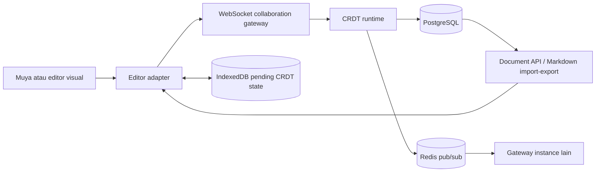

# Rencana refactor LTree dan kolaborasi Markdown

Status: kontrak produk disepakati; implementasi mengikuti policy dan spike gates; belum siap produksi
Tanggal: 2026-09-27
Cakupan: Markdown, AST node kanonis, kolaborasi online/offline berbasis CRDT; LTree opsional setelah bukti query

Keputusan utama tercatat di [ADR AST kanonis](../adr/0002-canonical-markdown-ast.md), [ADR scope kolaborasi](../adr/0001-collaborative-markdown-scope.md), dan [ADR pola Outline/Yjs](../adr/0003-outline-yjs-tree-and-relational-projection.md). Rincian domain, schema, protocol, migration, dan failure behavior ada di [spesifikasi domain/teknis](../specs/dokudocs-collaborative-markdown-domain-technical.md). Gambaran komponen, boundary consistency, dan alur runtime ada di [dokumen arsitektur](../architecture/dokudocs-collaborative-markdown.md).
Siklus pending edit saat penyimpanan lokal gagal atau pengguna logout dicatat di [ADR offline pending edit](../adr/0007-offline-pending-edit-lifecycle.md).
Restore yang memisahkan edit offline dari body baru dicatat di [ADR BodyEpoch](../adr/0008-restore-starts-body-epoch.md).
Structural MoveNode/DeleteNode yang membangun ulang Yjs shared state dan menahan pending lama dicatat di [ADR perubahan struktural memulai epoch](../adr/0014-structural-moves-start-body-epoch.md).

Tahap setelah AST untuk chatbot ada di [proyeksi fondasi RAG](dokudocs-rag-foundation.md).
Temuan audit yang belum dicakup dan urutan penutupannya ada di [rencana gap closure](dokudocs-refactor-gap-closure.md). Rencana ini harus dibaca bersama [ADR effective access](../adr/0005-document-access-policy.md) dan [ADR track changes](../adr/0006-track-changes-outside-canonical-body.md).

**Sumber gate eksekusi tunggal:** [G0–G5 pada rencana gap closure](dokudocs-refactor-gap-closure.md). Bagian milestone P0/M0/M1–M7 di dokumen ini menjelaskan capability breakdown, bukan tracker atau gate kedua. Pemetaan: P0→G0; M0→G1; M1–M2→G2; M3–M4→G3; M5→G3/G4; M6→G3; M7→production gate setelah G0–G5.

## Ringkasan keputusan

- Kolaborasi realtime hanya untuk Markdown. DBML dan Mermaid tetap memakai teks yang ada.
- Dokumen Markdown disimpan sebagai AST node relasional. Markdown menjadi format impor/ekspor.
- AST memakai node blok/container dan run pada batas format, link, atau objek inline; bukan node per kata.
- `parent_id` dan urutan sibling menentukan struktur. LTree/`node_path` ditunda sampai query subtree konkret dan benchmark membuktikan manfaat dibanding recursive query.
- Jalur sinkronisasi mengikuti pola Outline: schema tree ProseMirror/Yjs untuk edit bersama, dengan AST relasional Dokudocs sebagai projection kanonis untuk query, Markdown, komentar, dan revisi. RAG berada di G5; pilihan runtime Go atau Node ditentukan oleh spike.
- Editor dokumen mempertahankan pengalaman view dan editor; Muya boleh diganti jika spike binding gagal. Suggestion/track changes masuk G4, terpisah dari body hingga diterima. Acceptance yang memindahkan atau menghapus node lama mengikuti `MoveNode`/`DeleteNode` dan memulai epoch baru bila struktur berubah. Editor source Markdown mentah tidak menjadi jalur edit produk; Markdown tetap tersedia melalui import/export.
- Edit offline didukung. Browser menyimpan state/update CRDT dan queue command `MoveNode`/`DeleteNode` di IndexedDB sampai ACK PostgreSQL. Reconnect menggabungkan update isi/format dan mereplay structural command dalam `body_epoch` yang sama setelah pemeriksaan akses. Presence/cursor menyusul setelah sync stabil.
- Restore dan structural MoveNode/DeleteNode yang mengubah tree menaikkan `body_version` serta `body_epoch` dan membangun Yjs state baru secara atomik. DeleteNode memakai receipt durable; update/command epoch lama tetap pending untuk review. Pending update dari epoch sebelumnya ditahan untuk review berdampingan dengan body terkini; pengguna menyalin teks/blok terpilih menjadi edit baru pada epoch terkini.
- Offline berlaku untuk dokumen Markdown existing yang body lengkapnya sudah tersimpan pada perangkat setelah akses sah. Create/import dokumen baru memerlukan koneksi server. Dalam satu profil browser, hanya satu tab penulis aktif untuk User+Document; tab lain perlu handoff sebelum mengedit.
- Kegagalan IndexedDB menghentikan input edit baru sampai pending state berhasil disimpan. Logout dengan edit pending menawarkan sync atau ekspor setelah verifikasi hak baca; logout yang dikonfirmasi menghapus data lokal User dari browser.
- PostgreSQL menjadi penyimpanan durable. Update CRDT dan perubahan AST disimpan dalam satu transaksi ber-lock per dokumen sebelum ACK. Redis hanya untuk fan-out/sesi sementara.
- Tidak ada operation log append-only pada fase awal. Simpan state CRDT dan AST projection; IndexedDB menyimpan perubahan lokal yang belum di-ACK.
- Pertahankan thread, reply, resolve, revision otomatis/bernama, dan restore. Komentar rilis pertama menandai satu blok dengan node ID dan posisi relatif CRDT; anchor yang tidak dapat dipulihkan menjadi orphan secara eksplisit.
- Sintaks Markdown yang belum aman dinormalisasi dipertahankan persis sebagai blok opaque baca saja; blok lain dalam dokumen tetap dapat diedit.
- Urutan sibling memakai midpoint `DOUBLE PRECISION` sesuai keputusan pengguna. Jika midpoint tidak lagi representable secara ketat di antara tetangga, reindex sibling dari parent terkait dalam transaksi dan ulangi insert.
- Bila LTree kelak lulus gate query/benchmark, path memakai label node ID stabil dan dapat dibangun ulang dari parent; reorder tidak mengubah path dan reparent memperbarui subtree dalam transaksi.
- Migrasikan hanya data backend demo/dev Markdown in-place; pertahankan document ID, revisions, dan comments. Abaikan localStorage/Zustand demo sebagai sumber migrasi. DBML/Mermaid tidak dikonversi. Wajib lolos round-trip sebelum AST menjadi sumber baca/tulis utama.
- Perbaiki effective document access untuk seluruh baca/tulis sebelum membuka WebSocket/RAG; policy existing belum menerapkan visibility/grant/draft secara konsisten. Usulan pending dan riwayatnya tidak menjadi body atau sumber RAG.
- Sasaran produksi adalah availability dan scalability tinggi, tetapi referensi tidak memberi angka kapasitas atau SLO. Tetapkan angka melalui sizing/load-test sebelum rilis; baseline PostgreSQL lock wajib lolos load dan failover gate.

## Kondisi repo pada baseline awal (2026-09-27)

Bagian ini mencatat keadaan sebelum migration AST/Yjs dan integrasi bertahap berikutnya; bukan status repository terkini. Status implementasi terkini dan bukti perubahannya ada pada [gap closure](dokudocs-refactor-gap-closure.md).

- Backend Go menyimpan semua konten pada `documents.content TEXT`; tipe dokumen mencakup Markdown, DBML, dan Mermaid.
- Frontend saat ini memakai Muya dalam alur editor yang dibungkus komponen Monaco; mode suggestion dokumen adalah target produk, belum tampak sebagai mode tersendiri di komponen editor saat ini. Alur editor masih menyimpan konten lewat state lokal; belum memakai API dokumen backend untuk edit.
- Muya memakai operasi `ot-json1` dan `ot-text-unicode` untuk history/undo lokal. Repo belum memiliki library CRDT.
- Backend sudah memiliki `document_accesses`, `comment_threads`, `comment_replies`, dan `document_revisions`; alur komentar/revisi belum terhubung penuh ke editor kolaboratif.
- Frontend saat ini masih menyimpan dokumen, komentar, dan revisi demo di Zustand/localStorage per user. Data demo localStorage tidak dimigrasikan; IndexedDB untuk offline adalah persistence produk baru bagi update CRDT yang belum di-ACK.
- `documents.content` update saat ini mengganti teks utuh dan mengabaikan string kosong. Jalur ini perlu digantikan untuk Markdown, bukan dipakai sebagai protokol kolaborasi. Create, duplicate, import, restore, dan seed harus melewati satu domain body write path.
- Docker Compose backend saat ini menyalakan PostgreSQL 16 saja; LTree dan Redis belum dikonfigurasi.

File acuan: `backend/database/migrations/20260909000015_create_documents_table.up.sql`, `20260909000017_create_document_accesses_table.up.sql`, `20260909000020_create_comment_threads_table.up.sql`, `20260909000021_create_comment_replies_table.up.sql`, `20260909000022_create_document_revisions_table.up.sql`, `frontend/src/features/docs/components/markdown-editor.tsx`, dan `frontend/src/features/docs/hooks/use-doc-editor.ts`.

## Refactor skema database existing

Refactor dimulai dari skema Dokudocs, bukan DDL generik video. `documents` saat ini memuat body seluruh tipe di `content TEXT`; enum `document_type` adalah `markdown`, `dbdiagram`, dan `mermaid`. Tabel metadata, workspace/project, author, tags, visibility, share token, thumbnails, soft delete, serta document access dipertahankan.

| Tabel saat ini | Delta skema | Strategi data |
| --- | --- | --- |
| `documents` | Tambah `root_node_id UUID` untuk Markdown, `body_version BIGINT NOT NULL DEFAULT 1`, `body_epoch BIGINT NOT NULL DEFAULT 1`, dan `body_schema_version INTEGER NOT NULL DEFAULT 1`. | Pertahankan `id` dan seluruh metadata. Backfill root hanya untuk Markdown; verifikasi root menunjuk node tanpa parent dalam dokumen yang sama. Restore dan structural MoveNode/DeleteNode yang mengubah tree menaikkan epoch; `content` berhenti menjadi sumber body Markdown setelah cutover, tetapi kolomnya tetap dipakai DBML/Mermaid. |
| `document_nodes` (baru) | Parent composite FK, stable UUID, `sibling_order DOUBLE PRECISION`, `node_type`, `content`, `attributes JSONB`. | AST block/container/run dibuat dari `documents.content` Markdown dev. `parent_id` + order kanonis. `node_path` LTree bukan bagian migration awal. |
| `document_collab_states` (baru) | Satu row per dokumen Markdown: encoded Yjs state `BYTEA`, schema version, timestamp. | Buat state awal dari AST backfill; tidak ada operation log append-only fase awal. |
| `document_accesses` | Tidak ada schema baru. | Tetap memakai `owner/edit/comment/view`; semua akses melalui otorisasi Dokudocs. |
| `comment_threads` | Tambah `anchor_node_id`, binary relative positions, `anchor_state`. | Rilis pertama satu anchor dalam satu blok. Pertahankan thread, `selected_text`, resolve, timestamps, dan replies. Map `block_id/from_pos/to_pos/block_path`; anchor ambigu jadi orphan. Kolom anchor lama baru dibuang setelah cutover UI tervalidasi. |
| `comment_replies` | Tidak ada perubahan wajib. | Pertahankan FK cascade ke thread, isi, author, timestamps. |
| `document_suggestions` (G4) | Proposal typed operations, node target, basis versi, status, pengusul, pemutus, dan waktu. | Schema dan storage ditunda sampai G4; bukan dependency AST cutover. |
| `document_revisions` | Tambah `ast_snapshot JSONB`, `body_version`, `body_schema_version`, dan nullable `restore_request_id` unik per dokumen. | Pertahankan ID, author, version number, title, named flag, timestamps. Markdown menjadi snapshot AST; DBML/Mermaid tetap memakai `content`. Retry restore tidak membuat hasil ganda. |

Migration additive memakai tabel AST/state, kolom nullable/ber-default, composite foreign keys, unique root/sibling indexes, serta indeks parent-order. Jangan pasang extension/path/GiST LTree sampai ada query bernama dan benchmark yang membenarkan proyeksi turunan. Jalankan ekspansi dahulu; jangan menghapus atau mengganti kolom lama pada migration backfill.

Urutan backfill/cutover database:

1. Ambil snapshot/backup PostgreSQL demo-dev; catat jumlah dokumen per type, ID, revision/thread/reply counts, dan checksum konten. LocalStorage/Zustand demo tidak menjadi input.
2. Hentikan sementara mutasi body saat cutover dev, atau pastikan semua mutasi sudah lewat body domain write path. Jangan lakukan dual-write yang tidak atomik antara Markdown `content` dan AST.
3. Tambahkan kolom `documents.root_node_id/body_version/body_epoch/body_schema_version`; buat `document_nodes` dan `document_collab_states`; tambah field anchor/revision secara nullable/additive.
4. Per dokumen `type='markdown'`, parse `content`, buat root/node IDs deterministik, sibling order, state Yjs awal, dan set root reference dalam transaksi. Dokumen `dbdiagram`/`mermaid` tidak disentuh.
5. Migrasikan revision Markdown ke `ast_snapshot` dengan metadata versi yang sama. Map comment anchor lama hanya bila node/range dapat diverifikasi; jika gagal, pertahankan thread dan tandai anchor orphan. Replies tetap terhubung lewat `thread_id`.
6. Validasi FK dan root, parent same-document, satu root, acyclicity, order uniqueness, jumlah revisions/comments/replies, round-trip Markdown, dan checksum per dokumen. Tahan cutover jika ada konten hilang atau mismatch yang belum dijelaskan.
7. Alihkan Markdown read/write/API/editor ke AST + collaboration write path. API Markdown mengembalikan hasil export AST; `documents.content` tidak lagi dibaca/ditulis untuk Markdown. Tetap gunakan kolom itu untuk `dbdiagram`/`mermaid`.
8. Setelah masa verifikasi dev, hapus kolom komentar anchor lama hanya bila tidak lagi dibutuhkan. Pertahankan `document_revisions.content` untuk snapshot DBML/Mermaid dan `documents.content` untuk body DBML/Mermaid; jangan drop dua kolom bersama itu.

Rollback sebelum edit baru: kembali ke `documents.content` dan snapshot backup. Setelah ada Accepted Edit baru, ekspor AST terkini menjadi Markdown sebelum rollback; revision/thread lama tetap dipertahankan. Detail field, FK, dan SQL konseptual ada di bagian [skema existing dan persistence](../specs/dokudocs-collaborative-markdown-domain-technical.md#5-model-persistence-postgresql).

## Invarian desain

1. AST yang tersimpan menjadi representasi aplikasi untuk baca/query/ekspor Markdown. Binary CRDT adalah state kolaborasi untuk melanjutkan convergence dan juga memuat state dokumen; keduanya wajib merepresentasikan isi yang sama dan hanya boleh commit bersama.
2. Satu update yang di-ACK sudah durable di PostgreSQL. Gagal commit berarti tidak ada ACK dan update belum disiarkan sebagai diterima.
3. Semua perubahan yang menyentuh satu dokumen mengikuti urutan serialisasi dokumen: state CRDT, AST, sibling order, versi dokumen, dan efek anchor terkait commit atau rollback bersama. LTree path ikut hanya bila optimasi itu kemudian diadopsi.
4. `parent_id` harus menunjuk node dalam dokumen yang sama. Root tepat satu per dokumen; root tidak punya parent. Siklus dilarang.
5. `parent_id` dan sibling order adalah sumber struktur. Jika `node_path` LTree ditambahkan, ia selalu dibangun ulang dari parent dan ID stabil, tidak diedit API/client.
6. Setiap perubahan parent/sibling order pada node ID yang sudah ada melalui `MoveNode`; penghapusan node existing melalui `DeleteNode` ber-receipt durable dan memulai epoch baru bila berubah. Command tervalidasi memperbarui Yjs/AST atomik, beserta LTree descendant path hanya bila LTree diadopsi.
7. Semua baca, join WebSocket, dan update edit memakai effective access policy Dokudocs yang diperbaiki. Update durable mengambil shared lock workspace membership, lalu project/project membership, lalu document row `FOR UPDATE`, lalu shared lock direct document grant; grant yang belum ada dipagari document row. Policy dicek ulang di transaksi. Mutasi ACL mengambil exclusive lock pada sumber yang sama dengan urutan yang sama.
8. Anchor komentar yang gagal di-resolve tidak boleh dipindah otomatis ke teks lain hanya karena kutipannya cocok.
9. DBML dan Mermaid tetap menggunakan jalur teks lama dan tidak ikut migrasi node/CRDT.
10. Perubahan offline yang sudah tersimpan lokal tetap pending sampai server ACK durable. Reconnect memeriksa izin dan `body_epoch` sebelum merge. Bila hak edit hilang tetapi hak baca tetap ada, update menjadi blocked dan dapat diekspor setelah verifikasi. Bila server mengonfirmasi hak baca hilang, hapus cached body dan pending state/command dokumen pada perangkat. Epoch lama akibat restore atau structural MoveNode/DeleteNode ditahan untuk review dan penerapan ulang sadar, tanpa merge otomatis. Command struktural tanpa receipt yang tiba dengan epoch stale menjadi konflik, bukan direlabel ke epoch baru.
11. Pending Suggestion, termasuk hasil AI, bukan body kanonis dan tidak menaikkan `body_version`; hanya acceptance yang commit AST/Yjs dan boleh masuk RAG.

## Arsitektur tujuan

Runtime kolaborasi tetap menjadi gerbang keputusan spike. Jalur Go mengurangi jumlah runtime tetapi harus membuktikan kompatibilitas Yjs. Jalur Node dapat memakai ekosistem Yjs langsung tetapi harus tetap mematuhi auth Dokudocs dan durability ACK per update. Persistence Hocuspocus yang di-debounce tidak boleh dianggap durable sebelum ACK tanpa bukti/protokol khusus.

## Model penyimpanan

### Dokumen dan node

Pertahankan `documents` sebagai metadata dan identitas dokumen. Untuk Markdown, migrasikan body dari teks menjadi tree node:

| Entitas | Isi dan aturan |
| --- | --- |
| `document_nodes` | `node_id`, `document_id`, `parent_id`, `sibling_order DOUBLE PRECISION`, `node_type`, `content`, `attributes JSONB`, dan timestamp/version yang dibutuhkan. Konten teks hanya berada pada run/leaf yang sesuai. |
| Root node | Satu root per Markdown document; hubungkan dengan FK deferrable bila siklus insert root/dokumen memerlukannya. |
| CRDT state | Satu record per dokumen yang menyimpan encoded state Yjs-compatible sebagai binary (`BYTEA`), ditambah format version dan timestamp. State ini bukan sekadar metadata; ia harus konsisten atomik dengan AST. Tidak menyimpan operation log terpisah di fase awal. |
| `document_revisions` | Simpan snapshot AST untuk Markdown revisions. Named snapshot immutable; autosnapshot boleh dicoalesce 10 menit sebelum sealed. Pertahankan author, nomor versi, nama, dan waktu yang sudah terlihat di produk. |
| `comment_threads` | Pertahankan body, author, resolve state, kutipan, dan reply. Tambahkan nullable node ID anchor (`ON DELETE SET NULL`), encoded start/end relative positions, status anchor aktif/orphan, dan konteks kutipan yang diperlukan. Penghapusan node tidak boleh menghapus thread. |

Constraint dan index minimum:

- Composite uniqueness `(document_id, node_id)` dan composite FK `(document_id, parent_id)` agar parent lintas dokumen mustahil.
- Validasi root tunggal dan aturan parent/type di repository serta constraint DB sejauh dapat dinyatakan.
- Index `(document_id, parent_id, sibling_order)` untuk baca urutan anak.
- Index komentar berdasarkan `(document_id, target_node_id)`/anchor node dan revision berdasarkan `(document_id, version_number)`.
- Pertimbangkan `CHECK` untuk mencegah sibling order non-finite; tetap validasi NaN/Inf dan midpoint di aplikasi sebelum menulis.
- Jalankan validasi siklus sebelum reparent. Lock dokumen melindungi semua penulis kolaboratif, tetapi tidak menggantikan validasi parent.

Rekursi `parent_id` menjadi implementasi subtree awal. Adopsi LTree memerlukan caller produk yang konkret dan benchmark representative yang menunjukkan keuntungan atas recursive query; jika lulus, path turunan dapat dihitung ulang dari `parent_id` dan ID node. [Dokumentasi PostgreSQL LTree](https://www.postgresql.org/docs/18/ltree.html)

### Urutan sibling Float64

Gunakan midpoint di antara sibling kiri dan kanan. Server tidak menerima nilai urutan arbitrer dari client; urutan akhir berasal dari CRDT yang tervalidasi dan diproyeksikan oleh server.

1. Di bawah lock dokumen, baca sibling terkait dan hitung midpoint.
2. Terima hanya jika `left < midpoint && midpoint < right` dan nilainya finite serta tidak melanggar keunikan.
3. Jika gagal, reindex seluruh sibling dari parent tersebut menjadi `1, 2, 3, ...` dalam transaksi yang sama, lalu hitung ulang.
4. Untuk insert paling awal/akhir, gunakan jarak yang konsisten dari tetangga; periksa representability dengan aturan yang sama.
5. Jika node hasil merge CRDT berdekatan tidak memiliki ruang Float64, reindex parent sebelum menyimpan projection.

Jangan gunakan ambang absolut `1e-15`: jarak representable berubah mengikuti magnitude. PostgreSQL mendefinisikan `double precision` sebagai inexact floating point, sehingga pemeriksaan strict-neighbor dan rebalancing adalah kewajiban, bukan optimasi opsional. [Dokumentasi numeric PostgreSQL](https://www.postgresql.org/docs/16/datatype-numeric.html)

### Gate adopsi LTree

Jangan tambahkan `node_path`, extension, atau GiST pada migration AST awal. Jika profiling mengidentifikasi query subtree yang nyata, bandingkan query berbasis parent recursion dengan LTree pada dataset representative. Path LTree yang ditambahkan tetap turunan, dibangun server dari parent/ID dan disimpan atomik bersama reparent; client tidak pernah mengirim path.

## Protokol update dan durability

Alur server untuk satu update:

1. Autentikasi koneksi dan cek awal hak edit pada dokumen/workspace memakai effective policy Dokudocs. Tolak viewer/commenter dari jalur edit.
2. Validasi ukuran, jenis update, document ID, serta rate/queue limit sebelum operasi mahal.
3. Mulai transaksi; lock baris dokumen yang menjadi serialisasi per-document, lalu cek ulang izin terkini di bawah lock. Mutasi grant/visibility/trash yang mencabut akses mengambil lock yang sama.
4. Muat state CRDT durable terbaru dan node AST terkait dari PostgreSQL. Jangan bergantung pada cache instance lain sebagai sumber kebenaran.
5. Terapkan update CRDT, validasi bentuk AST terhadap schema Markdown, dan hitung node yang berubah.
6. Proyeksikan hasil ke node AST; hitung sibling order midpoint dan reindex parent bila perlu. Jika LTree kelak diadopsi, perbarui path subtree dalam transaksi yang sama.
7. Simpan state CRDT binary, semua node terkait, versi dokumen, dan perubahan status anchor yang diperlukan dalam transaksi yang sama.
8. Commit. Baru setelah commit kirim ACK kepada pengirim dan publish update ke Redis untuk koneksi pada instance lain.
9. Bila commit gagal, jangan ACK atau publish sebagai update diterima. Retry atas update berulang harus aman/idempotent; Yjs menyatakan update bersifat komutatif, asosiatif, dan idempotent. [Yjs document updates](https://docs.yjs.dev/api/document-updates)

Redis hanya untuk fan-out dan state sesi sementara. ACK origin berarti commit PostgreSQL durable, meski Redis pub/sub gagal; origin tidak kembali menjadi pending. Peserta lain membandingkan `body_version` dari pesan dan pemeriksaan head berkala, lalu menyinkronkan state dari PostgreSQL jika ada gap, termasuk pesan terakhir yang hilang tanpa reconnect. Reconnect mengotorisasi ulang dan membandingkan `body_epoch` sebelum merge pending IndexedDB; epoch lama akibat restore atau structural MoveNode/DeleteNode ditahan untuk review. Konflik MoveNode/DeleteNode ditahan untuk resolusi pengguna.

## Spike yang harus selesai sebelum menetapkan runtime/editor

### Spike A — Protokol dan server Go vs Node

Bandingkan implementasi Go Yjs-compatible dan service Node. Buktikan:

- Browser Yjs client bertukar update dan state vector dengan runtime tanpa korupsi.
- Auth Dokudocs dan hak akses berlaku saat join dan selama sesi; access revoke menutup hak edit.
- Dua runtime/instance memproses edit bersamaan pada dokumen yang sama tanpa lost update.
- Lock PostgreSQL serializes read-merge-persist; state CRDT dan node AST atomik.
- Restart setelah ACK memulihkan isi identik dari PostgreSQL.
- ACK tidak mendahului commit. Simulasikan commit gagal, ACK hilang, Redis down, dan retry update.
- Fan-out lintas instance melalui Redis serta backpressure/disconnect.
- Ukur biaya load state, transaksi, ukuran binary state, node projection, dan lock contention.

Pilih runtime dengan hasil kompatibilitas, reliability, dan kompleksitas integrasi. Jangan menganggap debounce save adalah jaminan ACK durable.

### Spike B — Editor dan AST/Markdown adapter

- Prototipe CRDT binding pada Muya yang ada terlebih dahulu; Muya saat ini memakai OT internal, sehingga binding remote CRDT belum terbukti.
- Uji fallback editor ProseMirror/Tiptap jika Muya tidak dapat mempertahankan model blok/run dan undo yang benar. [Yjs ProseMirror binding](https://docs.yjs.dev/ecosystem/editor-bindings/prosemirror)
- Prototipe pengalaman view/editor/suggestion dengan Muya atau engine pengganti. Usulan track changes mencakup teks, format, dan struktur blok; tidak mengubah body sampai diterima. Perubahan mode tidak boleh mengganti ID node yang tidak berubah atau merusak anchor.
- Bukti minimum: dua atau lebih client, format inline/block, undo lokal yang tidak membatalkan edit pengguna lain, reconnect online, dan perpindahan antar mode Muya.

### Spike C — Format dan batas round-trip

- Inventaris seluruh konstruksi Markdown yang sekarang didukung Muya dan fixtures test.
- Parse ke AST dan export kembali secara identik untuk dokumen demo yang didukung.
- Uji gambar, link, tabel, code fence, list bersarang, quote, footnote, dan format inline sesuai fitur yang benar-benar ada di repo.
- Jika syntax tidak dapat direpresentasikan, pertahankan bytes source sebagai raw/opaque Markdown node baca saja atau selesaikan sebelum cutover; jangan buang diam-diam. Edit/move yang menargetkan blok opaque ditolak, sementara blok lain tetap editable.
- Pastikan import Markdown dan ekspor ulang mempertahankan node ID yang tidak berubah pada edit visual berikutnya.

## Rencana implementasi bertahap

### P0 — Effective access sebelum jalur realtime/RAG

- Terapkan satu policy baca/tulis yang menegakkan membership, visibility proyek/dokumen, direct grant, draft, public token, dan trash pada list/detail/search/export/editor. Matriks dan lokasi celah kode dirinci dalam [gap closure G0](dokudocs-refactor-gap-closure.md#g0--satukan-kontrak-akses-dan-tutup-jalur-lama-yang-berbahaya).
- Restore/permanent delete memeriksa workspace dokumen dari database dan hanya menerima DocumentOwner (`document_accesses.owner`) atau owner/admin workspace.
- Pembuatan dokumen dan grant owner awal harus satu transaksi; audit grant owner yang hilang pada data dev karena repository sekarang mengabaikan error insert grant.
- Revoke dan setiap body write mengambil lock pada sumber access row yang sama dengan urutan tetap; edit mengevaluasi ulang policy di transaksi yang juga mengunci dokumen. Jangan membuka WebSocket atau retrieval sebelum jalur baca aman.

**Gate:** daftar, detail, public token, editor, dan kandidat RAG membuat keputusan baca yang sama; mutasi dokumen workspace lain dengan header salah ditolak.

### M0 — Spike, baseline, dan keputusan runtime/editor

- Buat proof-of-concept kecil untuk tiga spike di atas; jangan membangun UI production sebelum semua gate utama lolos.
- Catat hasil kompatibilitas wire/state, pilihan Go/Node, Muya vs pengganti, parser/export limits, dan angka throughput/latency.
- Buktikan `MoveNode`/`DeleteNode` memperbarui state Yjs dan AST bersama; perubahan parent/order dan penghapusan node existing hanya melalui command tersebut. ACK origin hanya mengikuti commit PostgreSQL; subscriber pulih melalui deteksi gap versi. Tetapkan autentikasi WebSocket browser dan pemeriksaan Origin.
- Catat baseline latency/capacity untuk memilih runtime. Angka target SLO produksi ditetapkan pada M7, sebelum rilis.
- Keputusan runtime/editor menjadi ADR setelah hasil spike, bukan sebelum.

**Gate:** teknologi mampu meng-ACK hanya setelah durable commit; recovery dan round-trip berhasil. Jika target kapasitas belum diberi angka, pekerjaan boleh lanjut untuk correctness tetapi deployment produksi belum disetujui.

### M1 — Schema AST, revisions, dan anchor (G2)

- Tambah tabel node dan CRDT state, constraints parent/document/root, serta indeks parent/order.
- Perluas revision snapshot dari Markdown ke AST sambil mempertahankan metadata versi.
- Perluas comment anchor untuk node ID, encoded relative positions, quote, dan orphan status.
- Gunakan `document_accesses`; jangan buat tabel user/permission baru seperti contoh generik video.
- Tambahkan model Go dan repository kecil per domain; pakai `database/sql`/transaction abstraction yang sudah ada.
- Tunda extension, `node_path`, dan GiST LTree sampai query subtree konkret serta benchmark recursive query menunjukkan manfaat. Suggestion storage adalah G4, bukan migration AST.

**Gate:** constraint menolak parent lintas dokumen, root ganda, siklus/reparent ilegal, dan order duplicate/non-finite.

### M2 — Parser/import/export dan backfill data demo/dev

- Parser Muya atau adapter yang dipilih menghasilkan block/container/run dengan ID stabil.
- Bekukan corpus synthetic Markdown berversi dari syntax yang didukung dan tes Muya; supported syntax harus round-trip exact-byte, sedangkan syntax yang tak didukung menjadi opaque. Jangan memasukkan isi backup dokumen ke corpus.
- Backfill `documents.content` Markdown in-place ke root + node. Pertahankan `document_id`; migrasikan revision content ke AST snapshot; tautkan comment anchor sedapat mungkin dan tandai yang tidak cocok sebagai orphan.
- DBML/Mermaid tetap pada `documents.content` dan tidak membuat node.
- Selama validasi, simpan kolom `content` lama sebagai pembanding/backout; jangan menerima dua sumber tulis.
- Bandingkan Markdown export dengan isi awal; buat laporan per dokumen untuk setiap mismatch. Cutover hanya sesudah mismatch diselesaikan atau syntax dipertahankan persis sebagai opaque node baca saja.
- Abaikan migrasi dokumen demo localStorage/Zustand; data itu bukan sumber migrasi backend. Jangan menghapus data demo lewat refactor ini.
- Alihkan seluruh consumer Markdown `documents.content`, termasuk list/search `ILIKE`, public link, create/update/duplicate, revision/restore, import/export, thumbnail, dan seeder. Pastikan tidak ada query body Markdown stale setelah cutover.
- Setelah cutover, `documents.content` hanya compatibility export sementara; hapus atau hentikan pemakaiannya setelah semua API/UI membaca AST.

**Gate:** corpus golden dan setiap dokumen Markdown backend demo dapat di-export dan round-trip tanpa kehilangan; revisions/comments tetap dapat ditampilkan.

### M3 — API backend, otorisasi, transaksi update

- Tambahkan operasi load tree, update CRDT, query subtree, import/export Markdown, revisions, comments/replies/resolve.
- Otorisasi melalui effective policy G0 pada connection dan setiap edit; lock shared workspace membership, project/project membership, document row `FOR UPDATE`, lalu direct grant; recheck policy dalam transaksi. Mutasi ACL memakai urutan sumber yang sama.
- Update realtime tidak melewati endpoint update teks penuh. REST title/metadata tetap terpisah dari body.
- Lock per dokumen, merge, project AST, sibling-order rebalancing, version increment, state commit, ACK sesuai urutan protokol. LTree update tidak menjadi dependency write path awal.
- Hilangkan OCC reject sebagai strategi kolaborasi; versi dapat dipakai untuk revision/observability tetapi edit bersama harus digabungkan oleh CRDT.
- Perbaiki semantik konten kosong ketika jalur REST legacy masih dipakai selama cutover.

**Gate:** update bersamaan tidak menimpa, transaksi gagal tidak terlihat sebagai edit diterima, dan retry tidak menduplikasi konten.

### M4 — WebSocket runtime, Redis fan-out, dan reconnect offline

- Tambah gateway dari hasil spike dan WebSocket handshake yang terkait identitas + document ID; credential browser tidak masuk URL/log, Origin diperiksa, dan expiry/revoke menutup sesi.
- Redis pub/sub meneruskan update antar instance. Session runtime membersihkan koneksi putus melalui heartbeat/TTL; tidak ada lease mode editor sebagai kontrak produk.
- Tambahkan IndexedDB untuk Yjs state/update lokal dan queue `MoveNode` yang belum mendapat ACK, dengan status UI terpisah “tersimpan di perangkat” dan “tersinkron ke server”. Hapus pending lokal hanya setelah ACK/version durable cocok.
- Batasi offline ke dokumen existing yang body-nya sudah tersimpan lengkap. Buat koordinasi satu tab penulis aktif per User+Document dalam satu profil browser; tab kedua baca saja sampai handoff, dan tab crash tidak boleh meninggalkan lock permanen. Create/import baru menunggu koneksi server.
- Saat IndexedDB penuh atau gagal, hentikan input edit dan tampilkan status gagal menyimpan; lanjutkan hanya setelah pending state tersimpan. Logout/ganti akun menampilkan jumlah pending dan pilihan sync atau ekspor yang memerlukan hak baca saat itu; setelah logout dikonfirmasi, hapus state lokal User. Jika offline dan hak baca tidak bisa diverifikasi, pengguna dapat membatalkan logout untuk menunggu reconnect.
- Saat reconnect, recheck akses dan bandingkan `body_epoch` serta `BodySchemaVersion` sebelum state-vector sync. Bila keduanya sama, merge pending content update dan replay `MoveNode`/`DeleteNode` terhadap tree terkini. Bila epoch berubah, tahan pending untuk review. Bila schema tidak kompatibel, jangan kirim pending; perbarui app dan pertahankan data lokal sampai migrasi teruji atau pemulihan eksplisit tersedia.
- Jika hanya hak edit yang dicabut, pertahankan payload lokal sebagai blocked, hentikan retry otomatis, dan izinkan ekspor setelah hak baca diverifikasi. Jika server mengonfirmasi hak baca hilang, tutup editor dan hapus cached body serta seluruh pending update/command dokumen dari perangkat.
- Presence/cursor tetap mati pada milestone ini; jangan persist presence ke tabel dokumen. (Diubah 2026-10-01: presence kini masuk G6 di `dokudocs-refactor-gap-closure.md`, disimpan di Redis dengan TTL, bukan di PostgreSQL; kursor remote tetap di luar.)
- Tambahkan limits untuk payload, jumlah koneksi, dan backpressure; kegagalan pub/sub harus memicu resync, bukan silent divergence.
- Update local Docker Compose/env untuk Redis dan runtime yang terpilih setelah hasil spike.

**Gate:** dua browser di instance yang sama dan lintas instance converge; restart backend tidak kehilangan update yang sudah di-ACK.

### M5 — Frontend editor dan pengalaman komentar (G3/G4)

- Sambungkan document load/save ke API backend; hentikan local autosave sebagai source of truth untuk Markdown collaborative.
- Integrasikan Muya jika spike lulus; bila gagal gunakan editor replacement yang dipilih tanpa mengubah kemampuan produk yang disepakati.
- Hubungkan view/editor ke AST dan Yjs sesuai G3. Suggestion storage/UX, acceptance policy, dan AI edit berada di G4 atau fase produk setelahnya; jangan masukkan schema suggestion ke G2.
- Undo/redo hanya membatalkan operasi lokal pengguna, bukan edit collaborator.
- Ganti anchor offset/path rapuh dengan satu node ID + Yjs RelativePosition + quote untuk rentang di satu blok. Jika relative position tidak dapat diselesaikan, tandai orphan dan tawarkan reattach manual.
- Pertahankan thread/reply/edit/delete/resolve serta notifikasi yang sudah tersedia.

Relative positions dirancang untuk bertahan saat edit remote menggeser indeks; referensi dapat tidak tersedia bila shared type yang dituju dihapus. Karena itu quote dipakai untuk verifikasi/fallback dan orphan status tetap eksplisit. [Yjs relative positions](https://docs.yjs.dev/api/relative-positions)

**Gate:** anchor mengikuti insert/delete di sekitar range; penghapusan target tidak memindahkan komentar ke kecocokan teks yang ambigu.

### M6 — Revision snapshot dan restore

- Simpan snapshot AST untuk auto revision dan named revision dengan author/time/title/sequence yang ada. Named revision immutable; auto snapshot boleh dicoalesce dalam window 10 menit lalu sealed immutable.
- Pertahankan pola autosnapshot/coalescing yang terlihat pengguna saat ini (sekitar jendela 10 menit) serta versi bernama; pindahkan pemilik jadwal dari local autosave ke backend setelah cutover.
- Restore menjadi satu perubahan kolaboratif baru yang diterapkan dan di-ACK seperti edit lain; revision lama tidak ditulis ulang.
- Di bawah lock dokumen, bangun Yjs state baru dari snapshot AST dan tingkatkan `body_version` serta `body_epoch` dalam commit yang sama. Simpan `restore_request_id` pada revision hasil agar retry tidak mengulang restore.
- Broadcast epoch baru ke semua client aktif; mereka memisahkan pending epoch lama untuk review sebelum memuat body hasil restore. Client offline melakukan hal yang sama saat reconnect. Penerapan ulang hanya melalui operasi baru yang dipilih pengguna.
- Tampilkan hasil restore dan body lokal lama berdampingan. Dengan hak edit terkini, pengguna menyalin teks/blok yang dipilih ke editor baru; tidak ada rebase otomatis node/anchor. Pending lama tetap tersedia sampai pengguna menyelesaikan atau membuangnya, kecuali hak baca dicabut sesuai policy.
- Anchor yang tidak dapat dipulihkan setelah restore menjadi orphan.

**Gate:** restore tetap tampil pada history, editor lain melihat hasil yang sama, retry request yang sama tidak menaikkan epoch dua kali, pending offline lama tidak masuk otomatis, review berdampingan memungkinkan copy pilihan dengan hak edit terkini, dan restore dapat di-restart/recover dari DB.

### M7 — Load, failover, operasi, dan rilis produksi (setelah G0–G5)

- Jalankan beban dengan jumlah editor per dokumen dan jumlah dokumen aktif yang disepakati setelah M0.
- Ukur propagation p50/p95/p99, write/commit latency, lock wait, DB CPU/IO, ukuran state CRDT, rebalancing, Redis throughput, reconnect/recovery, serta error rate.
- Uji PostgreSQL failover/restart, Redis outage, app instance restart, client disconnect saat commit, access revoke, dan duplicate retry.
- Availability/scalability tinggi adalah target; jangan tandai siap produksi sebelum target numerik dan failure budget disepakati dan hasilnya lulus.
- Jika lock contention dokumen panas atau load/failover tidak lulus, revisi serialisasi/persistensi (misalnya actor/shard per dokumen atau durable log) sebelum rilis. Jangan menambah jalur itu tanpa bukti bottleneck.
- Presence/cursor dapat dinilai setelah sync stabil; bukan syarat AST cutover. Offline merge termasuk scope refactor dan wajib lolos G3 sebelum rilis.

## Perbaikan wajib pada contoh referensi

Jangan salin DDL/Go reference apa adanya:

- Model tabel `users` dan `document_permissions` tidak cocok dengan multi-tenancy dan `document_accesses` Dokudocs.
- `sql.NullUUID` bukan tipe `database/sql` standar; pilih tipe UUID scanner dari driver yang sudah dipakai atau implementasi scanner kecil sesuai pola repo.
- Loader tree contoh hanya menambahkan child jika parent sudah terbaca; jangan mengandalkan urutan query tanpa validasi parent/rows error.
- Loader harus memeriksa `rows.Err()`, parent hilang, root count, dan node lintas dokumen.
- Jika LTree kelak diadopsi, split run harus membangun path node baru dari ID-nya, bukan menyalin `node_path` node lama.
- Update text mentah/OCC bukan protokol kolaborasi. CRDT update harus merge, commit durable, lalu ACK.
- `DOUBLE PRECISION` midpoint memerlukan pengecekan representability, constraint, lock, dan rebalancing; ambang `1e-15` saja tidak cukup.
- DDL reference tidak menegakkan parent harus dari dokumen yang sama, urutan sibling unik, satu root, atau ketiadaan cycle.
- Contoh reparent path harus membentuk path baru dari path parent target dan suffix subtree; literal path input tidak boleh dipercaya.

## Definition of done

- Markdown disimpan dan diedit lewat AST node kanonis; DBML/Mermaid tetap tekstual.
- Import/export round-trip lulus atas fixtures dan seluruh dokumen demo.
- Dua atau lebih editor online converge pada edit block/run, format, delete, undo, dan restore. Penghapusan node existing lewat DeleteNode menaikkan epoch dan memiliki receipt durable; update offline dari epoch lama ditolak sebelum merge/ACK, lalu tetap pending untuk review. Pending dari epoch sebelum restore atau structural MoveNode/DeleteNode juga ditahan untuk review.
- Satu update hanya di-ACK setelah state CRDT + AST durable; restart memulihkan hasil yang sama.
- View/editor berbagi model dokumen; akses diperiksa saat koneksi dan pada setiap update durable dengan urutan ACL lock yang ditetapkan, pending offline bertahan sampai ACK, dan subscriber Redis pulih dari gap versi. Suggestion acceptance adalah G4.
- Thread/reply/resolve, revision otomatis/bernama/restore tetap ada; anchor komentar satu blok stabil atau secara eksplisit orphan.
- RAG chunking/citation dan AI draft/edit tidak termasuk DoD AST; lihat G5 dan plan AI terkait. Stable node IDs dan `body_version` cukup sebagai seam untuk tahap berikutnya.
- Parent/sibling order tetap konsisten setelah insert, split/merge run, reorder, dan reparent. Jika LTree kemudian diadopsi, path turunan harus tetap konsisten dan dapat direbuild.
- Load/failover test lulus angka kapasitas/SLO yang disepakati. Sampai angka dan hasil tersebut tersedia, statusnya belum production-ready.

## Sumber teknis

- [Yjs updates](https://docs.yjs.dev/api/document-updates)
- [Yjs relative positions](https://docs.yjs.dev/api/relative-positions)
- [Yjs ProseMirror integration](https://docs.yjs.dev/ecosystem/editor-bindings/prosemirror)
- [Hocuspocus persistence](https://tiptap.dev/docs/hocuspocus/guides/persistence)
- [PostgreSQL LTree](https://www.postgresql.org/docs/18/ltree.html)
- [PostgreSQL floating point](https://www.postgresql.org/docs/16/datatype-numeric.html)
