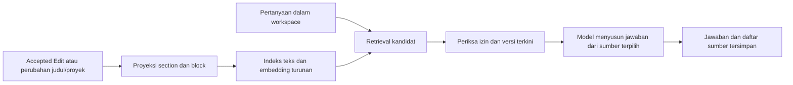

# Proyeksi fondasi RAG setelah AST Markdown

Status: fondasi dan retrieval semantik dasar berjalan; Gate G5 masih terbuka
Tanggal: 2026-10-01
Prasyarat: [rencana AST dan kolaborasi](dokudocs-ltree-collaborative-refactor.md), [gap closure akses/body](dokudocs-refactor-gap-closure.md), [kontrak AST](../adr/0002-canonical-markdown-ast.md), [kebijakan riwayat chat](../adr/0004-persistent-rag-chat-history.md)

## Tujuan dan batas

Fitur pertama adalah chatbot di DokuDocs. Pengguna bertanya dalam bahasa Indonesia atau Inggris, termasuk pertanyaan lanjutan, dan mendapat jawaban yang hanya didukung dokumen Markdown yang dapat ia baca di seluruh workspace. Satu jawaban boleh memakai beberapa dokumen. Jika bukti tidak cukup, chatbot menyatakan bahwa informasi tidak ditemukan; jika sumber bertentangan, chatbot menyebut pertentangannya. Daftar sumber di akhir jawaban menaut ke blok atau bagian yang tepat.

Dokumen Markdown aktif, termasuk draft yang boleh dibaca pengguna, menjadi sumber. Draft hanya boleh dibaca penulis dan pengguna dengan hak edit/owner efektif. Dokumen di trash, DBML, Mermaid, lampiran, komentar, revisi historis, dan Suggestion yang belum diterima tidak masuk indeks tahap pertama. Chatbot tidak mengubah dokumen. MCP eksternal bukan antarmuka tahap pertama; kelak ia dapat memakai fungsi retrieval yang sama tanpa menjadi pemilik indeks atau aturan akses.

## Aliran data

AST relasional tetap sumber isi. Markdown adalah format impor/ekspor dan dapat dipakai sebagai representasi untuk model, tetapi bukan sumber kedua bagi indeks. Chunk adalah proyeksi yang dapat dibangun ulang: mulai dari heading/section, pecah bagian panjang pada batas block, sertakan judul dokumen dan nama proyek bila ada sebagai konteks yang dapat dicari, breadcrumb, `document_id`, `body_version`, dan daftar `source_node_ids`. Renderer teks harus mempertahankan isi tabel, daftar, link, dan code fence yang bermakna; ia tidak mengindeks struktur AST mentah atau komentar sebagai prosa dokumen. Identitas chunk tidak menjadi identitas dokumen yang permanen; tautan sumber memakai node ID stabil.

Judul dan nama proyek membantu menemukan dokumen, tetapi tidak menjadi bukti bagi jawaban faktual. Setiap klaim dalam jawaban harus didukung teks body dari blok/section AST yang dapat dikutip. Dokumen kosong yang hanya cocok pada judul atau proyek tidak menghasilkan jawaban faktual; chatbot menyatakan bukti tidak ditemukan. Source citation menunjuk node body, bukan metadata judul/proyek.

Blok `raw/opaque` hanya menjadi sumber RAG bila renderer khusus menghasilkan teks terbaca yang aman dan tetap bisa dikutip lewat `node_id` blok tersebut. Bila belum ada renderer aman, worker melewati blok itu dan menyimpan `coverage_status=partial` serta jumlah node yang dilewati pada status indeks. Chunk dari blok lain tetap dapat dipakai; setelah pemeriksaan izin, UI memberi tahu bahwa cakupan dokumen itu belum lengkap. Source Markdown opaque mentah tidak dikirim sebagai bukti ke model.

## Proyeksi dan kesegaran

1. Setelah Accepted Edit, perubahan judul dokumen, pemindahan proyek, atau perubahan nama proyek commit, proses asinkron membaca AST, `body_version`, dan metadata sumber terkini. Pekerjaan indeks bukan bagian transaksi edit dan tidak menunda ACK kolaborasi.
2. Bentuk fingerprint sumber dari `(body_version, document_title, project_id, project_name, renderer_version)`. Worker membangun seluruh chunk satu dokumen dan menandai `indexed_source_fingerprint` hanya ketika hasil fingerprint itu lengkap. Pertahankan `indexed_body_version` untuk diagnosis. Jika body atau metadata berubah selama proses, hasil lama dibuang dan sumber terkini dijadwalkan ulang.
3. Worker mencari dokumen tanpa indeks atau dengan fingerprint terindeks/model embedding yang berbeda dari sumber/configuration terkini untuk retry dan pemulihan setelah restart. `embedding_model` mengidentifikasi provider/model/version persis; perubahan model memicu reindex tanpa mengubah source fingerprint atau `body_version`. Dengan begitu rename judul/proyek juga memicu indeks ulang tanpa menaikkan `body_version`. Polling cukup sebagai baseline; tambahkan outbox hanya bila pengukuran menunjukkan polling tidak memenuhi target.
4. Retrieval hanya memakai dokumen dengan `indexed_source_fingerprint` yang sama dengan fingerprint sumber terkini, `indexed_body_version = body_version`, dan `embedding_model` yang cocok dengan konfigurasi aktif (atau null bila embedding tidak aktif). Dokumen yang indeksnya tertinggal dilewati dan UI menyatakan hasil mungkin belum lengkap. Target operasional: setelah edit atau perubahan metadata berhenti, dokumen biasanya kembali tersedia dalam sekitar satu menit; ini target pengukuran, bukan jaminan keras.
5. Perubahan izin, workspace membership, draft visibility, token `public_link`, dan trash bisa terjadi tanpa menaikkan `body_version`. Karena itu metadata ACL di chunk hanya petunjuk filter: effective document access policy diperiksa terhadap keadaan terkini sebelum teks dikirim ke model dan sebelum jawaban dikirim ke pengguna. Dokumen `public_link` tanpa grant internal hanya boleh masuk bila anggota workspace memberikan bukti token valid pada request dalam sesi chat saat ini. Jangan simpan token/bukti di conversation, message, chunk, atau citation; sesi baru harus membuktikannya lagi. Trash tidak boleh terambil walaupun indeks belum dibersihkan.

## Data turunan dan riwayat di PostgreSQL

| Data | Isi minimum | Aturan kepemilikan |
| --- | --- | --- |
| Status indeks per dokumen | `document_id`; metadata proyeksi sukses (`indexed_body_version`, `indexed_source_fingerprint`, `coverage_status` `complete`/`partial`, jumlah node opaque yang dilewati, model embedding opsional, `indexed_at`); `failed_at` untuk kegagalan sejak sukses terakhir. Metadata sukses nullable sampai indeks berhasil pertama kali. | Turunan dari AST dan metadata judul/proyek; dapat diulang atau dibuang. Gagal reindex tidak mengganti proyeksi sukses sebelumnya; fingerprint mismatch tetap membuatnya tidak dapat diretrieve. Sukses berikutnya mengganti proyeksi secara atomik dan mengosongkan `failed_at`. |
| Chunk pencarian | `document_id`, `body_version`, `source_fingerprint`, urutan, teks terbaca, judul/proyek, breadcrumb, `source_node_ids`, dan embedding bila tahap semantik aktif. | Dihapus/dibangun ulang dari AST dan metadata sumber; bukan body kanonis. |
| Percakapan | ID, pembuat, workspace, waktu dibuat. | Pribadi bagi pembuat; tetap ada setelah pembuat keluar, hilang saat workspace atau percakapan dihapus. |
| Pesan | Percakapan, peran, teks, waktu, dan penanda sumber berubah/terhapus. | Jawaban adalah catatan historis, bukan sumber baru untuk RAG. |
| Sumber jawaban | Pesan jawaban, `document_id`, target `node_id`, `body_version`, dan `source_fingerprint` saat menjawab. | Referensi/kutipan dihapus saat dokumen sumber dihapus permanen. |

Jangan simpan salinan ACL sebagai otoritas di indeks. Status akses chat historis dan akses retrieval baru adalah dua aturan berbeda. Simpan teks jawaban secara terpisah dari referensi sumber agar penghapusan referensi tidak diam-diam menghapus jawaban yang menurut kebijakan harus bertahan.

## Retrieval dan jawaban

Gunakan satu fungsi aplikasi untuk mengambil kandidat terurut dalam satu workspace dengan identitas pengguna sebagai input. Untuk tahap pertama, proyeksi chunk dan metadata berada di PostgreSQL yang sudah dipakai aplikasi. Pencarian kata dapat memakai PostgreSQL full-text search; kebutuhan lintas bahasa memerlukan evaluasi pencarian semantik dengan embedding multibahasa. Penyimpanan embedding di PostgreSQL melalui pgvector adalah pilihan awal yang sederhana bila ekstensi tersedia; jangan menambah vector service terpisah sebelum ada hasil evaluasi atau beban yang menuntutnya. Kombinasi pencarian kata dan semantik dipilih berdasarkan pertanyaan nyata, terutama istilah produk, kode, sinonim, dan pertanyaan Indonesia terhadap dokumen Inggris. [PostgreSQL full-text search](https://www.postgresql.org/docs/current/textsearch.html), [pgvector](https://github.com/pgvector/pgvector)

Retrieval mengirim hanya potongan terpilih yang lolos izin dan fingerprint sumber terkini ke model, beserta ID sumber. Jawaban harus didasarkan pada potongan tersebut. Simpan daftar sumber di akhir berurutan, dengan `ordinal`, `document_id`, `node_id`, `source_body_version`, dan `source_fingerprint` yang dipakai; jika blok masih ada, tautan membuka blok terkini. Jika bloknya hilang, tampilkan sumber sebagai berubah/tidak tersedia tanpa mengarahkan ke blok lain. Bila body, judul, atau proyek sumber berubah setelah jawaban dibuat, jawaban historis tidak digenerasi ulang dan diberi tanda bahwa sumber berubah. Pertanyaan lanjutan boleh memakai topik dan pertanyaan sebelumnya untuk memahami konteks, tetapi retrieval dan pemeriksaan izin/fingerprint selalu dilakukan ulang. Teks jawaban lama, terutama yang sumbernya sudah berubah atau aksesnya dicabut, tidak boleh dikirim sebagai bukti ke model atau dipakai untuk mendukung jawaban baru.

Context builder selalu boleh memakai pesan pertanyaan User sebelumnya untuk menyelesaikan rujukan/ellipsis. Teks jawaban assistant lama hanya boleh ikut sebagai konteks bila semua source citation-nya masih dapat dibaca User dan fingerprint-nya sama dengan sumber terkini; jika ada citation yang berubah, dicabut, dihapus, atau hilang, hilangkan jawaban lama itu dari prompt. Jawaban baru tetap hanya boleh didukung retrieval terkini. Jika pertanyaan tidak dapat dipahami dari pertanyaan User sebelumnya dan sumber yang sekarang diizinkan, minta klarifikasi atau nyatakan bukti tidak ditemukan, jangan mengandalkan teks historis yang dihilangkan.

Simpan jawaban dan kutipan hanya setelah finalisasi singkat yang mengambil shared ACL/body locks dalam urutan G0, lalu memeriksa ulang membership, izin, public-link proof, dan fingerprint sumber sebelum append transaction. Jangan memegang lock selama panggilan model. Jika revoke, hard delete, atau body/fingerprint change commit lebih dulu, buang jawaban draft; ulang retrieval/generasi hanya bila sumber masih dapat dibaca. Jika finalisasi memegang lock lebih dulu, commit jawaban sebelum mutasi akses; sesudah commit, jawaban mengikuti kebijakan riwayat yang dipilih meski sumber kemudian berubah atau akses dicabut.

Sesi chat hanya dapat memakai token tautan publik yang benar-benar dibuktikan pengguna pada sesi itu; jangan menebak akses dari `visibility=public_link`, menyimpan token mentah dalam indeks, atau memakai token dari percakapan historis untuk pertanyaan baru. Riwayat pribadi dibaca melalui otorisasi pemilik percakapan meski membership workspace telah berakhir; endpoint mengirim pertanyaan baru tetap mensyaratkan membership dan effective source access saat itu.

Penyedia model jawaban dan embedding boleh eksternal. Baseline runtime memakai Responses API dengan model jawaban `gpt-5-mini`, JSON Schema untuk pasangan answer/source IDs, dan `store:false`; embeddings memakai `text-embedding-3-small`. Adapter hanya aktif bila `OPENAI_API_KEY` tersedia. Kirim hanya chunk yang diperlukan dan pertanyaan User sebelumnya; jangan kirim seluruh workspace atau jawaban historis. OpenAI menyatakan konten API tidak dipakai untuk pelatihan tanpa opt-in dan `store:false` menonaktifkan penyimpanan application state Responses, tetapi abuse-monitoring logs dapat menyimpan konten hingga 30 hari pada konfigurasi default. Sebelum produksi, cocokkan kebijakan organisasi provider dengan kebutuhan retensi produk; gunakan Modified Abuse Monitoring/Zero Data Retention bila batas itu diperlukan. [Model gpt-5-mini](https://developers.openai.com/api/docs/models/gpt-5-mini), [Structured Outputs](https://developers.openai.com/api/docs/guides/structured-outputs), [data controls](https://developers.openai.com/api/docs/guides/your-data). Perubahan embedding model memicu pengisian ulang vector.

## Riwayat dan penghapusan

Percakapan dan pesannya tersimpan lintas sesi, pribadi bagi pembuatnya, serta terkait satu workspace. Selama pengguna masih memiliki akses workspace, ia dapat mengirim pertanyaan baru. Setelah keluar, ia masih bisa membaca riwayat pribadi tetapi chat menjadi hanya-baca. Pencabutan akses ke satu dokumen tidak menghapus teks jawaban yang sudah tersimpan; pencarian baru tetap memakai izin terkini.

Simpan referensi sumber terstruktur bersama setiap jawaban agar perubahan dan penghapusan bisa ditangani. Jika dokumen sumber dihapus permanen, hapus chunk/embedding dan kutipan/tautan sumber terkait dari riwayat; tandai bahwa sebagian sumber jawaban sudah dihapus. **Teks jawaban historis tetap terlihat, termasuk fakta yang berasal dari dokumen tersebut.** Ini keputusan retensi produk yang disengaja, bukan jaminan penghapusan semua turunan konten. Jika workspace dihapus permanen, hapus percakapan terkait; jika pengguna menghapus percakapan, hapus riwayat itu. [ADR kebijakan riwayat](../adr/0004-persistent-rag-chat-history.md).

## Urutan implementasi setelah rencana AST

| Tahap | Hasil yang dapat dipakai | Gerbang lanjut |
| --- | --- | --- |
| R0 — Proyeksi sumber | Renderer AST ke teks, section/block chunks, judul/proyek, node references, `body_version`, source fingerprint, serta status cakupan opaque; dapat dibangun ulang dari AST dan metadata. | Contoh Markdown nyata menghasilkan teks terbaca dan tautan node yang benar; opaque yang tak aman dilewati dan ditandai partial. |
| R1 — Indeks asinkron | Worker, status `indexed_body_version` dan `indexed_source_fingerprint`, retry setelah restart, indeks ulang saat rename, penghapusan indeks saat sumber dihapus. Publish hanya menerima hasil bila fingerprint belum berubah selama render/embedding; retrieval sendiri juga melewati indeks stale. | Uji hasil worker terlambat saat body/metadata berubah: hasil lama dibuang atau tetap tidak tersaji; target pemulihan sekitar satu menit terukur. |
| R2 — Retrieval | Pencarian dalam workspace dengan policy baca terkini, token public link sesi yang valid, kandidat multibahasa, sumber blok, dan penanda cakupan parsial. | Pertanyaan Indonesia–Inggris, draft, izin berubah, token dicabut, trash, dan dokumen konflik memberi kandidat yang tepat; kecocokan judul/proyek tanpa teks body tidak menjadi bukti, opaque yang dilewati tidak disajikan sebagai bukti. |
| R3 — Chatbot | Jawaban bersumber, daftar tautan blok, penolakan bila bukti kurang, pertanyaan lanjutan. | Tidak ada jawaban faktual tanpa bukti blok body; konflik ditampilkan; pengguna hanya melihat isi yang boleh dibaca saat bertanya. Uji revoke dan perubahan sumber saat model bekerja: jika mutasi menang sebelum finalisasi, draft dibuang dan tidak dikirim/disimpan. |
| R4 — Riwayat | Percakapan pribadi persisten, status hanya-baca setelah keluar, penanda sumber berubah, aturan penghapusan. | Perilaku pencabutan akses, penghapusan dokumen, dan penghapusan workspace sesuai ADR. Uji urutan finalisasi-vs-revoke/hard-delete: finalisasi yang commit lebih dulu menyimpan jawaban; hard delete berikutnya menghapus citations saja, revoke berikutnya mempertahankan jawaban pribadi. |

R2 memiliki baseline implementasi: `text-embedding-3-small` (1536 dimensi) melalui API embedding OpenAI yang opsional, pgvector di PostgreSQL, dan penggabungan lexical + cosine retrieval dengan reciprocal-rank fusion. Jarak cosine maksimum 0,35 adalah batas konservatif sementara, belum hasil kalibrasi. `OPENAI_API_KEY` kosong mempertahankan mode lexical; bila tersedia, worker memproses paling banyak 32 chunk per batch dan baru menyimpan vector jika body version serta source fingerprint tetap terkini. Retrieval menghitung vector hanya atas chunk yang lolos ACL/freshness. HNSW/ANN ditunda sampai benchmark ukuran workspace menunjukkan scan terfilter perlu dipercepat. Provider embedding eksternal tidak diaktifkan tanpa key.

Sebelum menganggap R2 siap, kumpulkan pertanyaan dokumen nyata dengan jawaban/sumber acuan: lintas bahasa, istilah tepat, pertanyaan lanjutan, tanpa jawaban, serta sumber bertentangan. Ukur recall bagian sumber yang benar, precision kandidat, biaya model, waktu indeks kembali segar, dan waktu respons chat. MCP, lampiran, dan pencarian lintas workspace menunggu kebutuhan terpisah.

## Status implementasi 2026-10-01

**Keputusan test seam:** acceptance retrieval/chat melewati HTTP API + PostgreSQL disposable + fake answer/embedding model agar kontrak routing, persistence, ACL, dan citation diuji bersama tanpa ketergantungan provider eksternal. Test khusus adapter provider tetap menguji format request secara terpisah.

Seam HTTP/API + PostgreSQL + fake answer/embedding model kini berjalan pada test integrasi. Rute menyediakan create/ask dan daftar/baca/hapus percakapan pribadi. Retrieval memakai hybrid lexical + pgvector bila embedder tersedia, fallback lexical tanpa provider, ACL terkini, filter stale, indikator `sourcesMayBeIncomplete`, dan token public-link transient per request. Finalisasi memeriksa lagi membership, grant/token, body version, metadata fingerprint, serta chunk di dalam transaksi sebelum menyimpan pesan dan citation. Riwayat mempertahankan teks jawaban dan source version/fingerprint; hard delete menghapus citation via FK cascade. AST inline dirender sebagai chunk dengan paragraph/heading/cell node ID yang stabil. Retrieval menyertakan pertanyaan User terakhir untuk follow-up berfrasa anaforis seperti “What about that?”; pertanyaan mandiri tetap dicari tanpa konteks lama. Integrasi juga membuktikan pencarian Indonesia ke body Inggris, follow-up kontekstual, dan pertanyaan mandiri tanpa bukti.

Worker polling R1 kini berjalan tiap 10 detik, mengambil hingga 100 dokumen Markdown aktif per putaran, dan mengindeks ulang dokumen tanpa indeks atau yang body version/epoch, judul, proyek, atau renderer-nya stale. PostgreSQL advisory transaction lock mencegah beberapa instance membangun ulang dokumen yang sama bersamaan. Worker tidak menahan row lock sumber; bila body/metadata berubah selama render, filter versi/fingerprint membuat hasil antara tidak dapat diretrieve dan polling membangun ulang versi terkini. Retrieval dan indikator indeks tertinggal juga membandingkan `body_epoch`.

Renderer R0 sekarang membawa breadcrumb heading ke setiap chunk/citation, mencari chunk paragraf lewat istilah breadcrumb, dan membatasi teks per chunk hingga 3.000 rune sambil mempertahankan node sumber. Migration `20261001000003_add_rag_breadcrumbs` menambah kolom breadcrumb dan menaikkan renderer version agar indeks lama dibangun ulang.

Verifikasi: test integrasi membuktikan citation dan history menyimpan breadcrumb; pencarian nama section menemukan paragraf di bawahnya; epoch-stale tidak dapat diretrieve; worker membangun ulang indeks; dan instance kedua melewati dokumen yang sedang dikunci. Unit test membuktikan pemecahan teks Unicode panjang menjaga urutan teks, node ID, dan breadcrumb. `make -C backend test-integration` lulus penuh pada PostgreSQL dan Redis disposable setelah seluruh perubahan ini.

Gate G5 tetap terbuka. R0 sudah memiliki breadcrumb dan batas ukuran chunk, tetapi corpus renderer belum luas; waktu pulih R1 sekitar satu menit belum diukur pada beban nyata dan belum ada outbox. R2 sekarang menggabungkan lexical dan vector search, dan test HTTP + PostgreSQL + fake embedding membuktikan pertanyaan Indonesia menemukan body Inggris; cutoff cosine serta kualitas provider belum dievaluasi dengan corpus nyata, konflik sumber dan seluruh skenario public-link/draft/project ACL belum ditutup. Runtime kini mengonfigurasi adapter answer Responses API secara opsional dan meminta output terstruktur dengan sumber; tanpa API key, pertanyaan yang menemukan sumber tetap menjawab 503. Belum ada live provider evaluation atau UI chatbot/citation. R4 belum menandai sumber berubah pada UI atau menguji semua urutan revoke/hard-delete/workspace-delete. MCP tetap ditunda.

Progress G5 2026-10-01 (harness, belum ada angka provider): `go run ./cmd/rageval` menyapu cutoff cosine pada corpus dwibahasa (`backend/internal/rageval/testdata/corpus.json`: 10 answerable, 4 unanswerable, 3 konflik) dan butuh `OPENAI_API_KEY`; tanpa key ia berhenti tanpa mengukur apa pun, jadi cutoff 0,35 tetap belum terkalibrasi dan deteksi konflik tingkat jawaban belum dievaluasi (harness hanya mengukur apakah kedua sumber konflik lolos retrieval). Worker kini mengosongkan backlog embedding sampai 20 batch per tick; sebelumnya satu batch 32 chunk per 10 detik membuat pemulihan tumbuh linear terhadap backlog. Pengukuran sisi DB dengan embedder palsu: 200 dokumen pulih dalam ~0,34 dtk dan 2000 dokumen dalam ~5,7 dtk; latensi dan rate limit provider nyata belum terukur. Matriks revoke, trash/restore, hard-delete, keluar workspace, rename, dan hapus workspace terhadap indeks diuji di `rag_lifecycle_integration_test.go`. E2E browser→API `/assistant` ada di `e2e/ui/specs/smoke/rag-assistant.spec.ts` (`@live`, butuh `RAG_LIVE=1` dan backend ber-key); belum pernah dijalankan. Gate G5 tetap terbuka.
